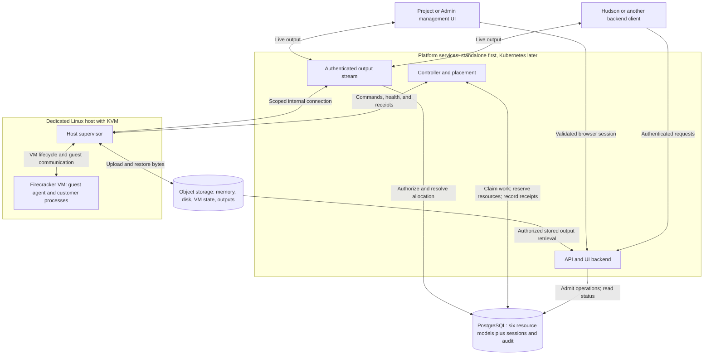

# Architecture

Status: selected design; implementation and verification pending. This document owns component boundaries, technology choices, deployment topology, and isolation boundaries. Read [the documentation index](README.md) for the detailed contracts.

## Purpose and ownership

Hudson Sandbox is a general-purpose secure runtime for untrusted Linux workloads. Scripts, applications, build jobs, automation, and services use the same core interfaces; AI agents are one possible client. [Product goal](goal.md) owns scope and priorities, including the initial secure execution milestone before pause/resume.

**Hudson is the agent harness. Hudson Sandbox is a tool it calls.**

Hudson Sandbox provides APIs to create, execute, pause, resume, and destroy isolated Linux sandboxes. It also handles files, execution limits, operation status, and resource cleanup. Clients do not need to use Hudson or Temporal to call these APIs.

| Component | Responsibility |
| --- | --- |
| Hudson harness, in the `hudson` repository | Agent behavior, business permissions, approvals, budgets, credentials, and any durable tasks implemented with Temporal |
| Hudson Sandbox, in this repository | Authenticated sandbox APIs, operation records, placement, lifecycle controllers, snapshots, execution limits, and cleanup |
| Kubernetes | Deployment and scheduling of platform services; resource controls for the workloads it manages |
| Firecracker and the host supervisor | Individual microVMs, their host resources, and isolated execution |

**This repository has no Temporal dependency.** It does not implement agent workflows, business approval logic, or a second durable workflow engine. PostgreSQL-backed operations and focused reconciliation loops provide the sandbox lifecycle's asynchronous control.

Hudson may wrap sandbox API calls in Temporal Activities in its own repository. Those calls use the same operation IDs, status APIs, and cancellation contracts as any other client. A sandbox does not receive Temporal credentials or understand workflow history.

The parent context is Hudson's [product goals](https://github.com/hudson-infinity/hudson/blob/main/docs/goals.md) and [Rust decision](https://github.com/hudson-infinity/hudson/blob/main/docs/implementation-decisions/0001-rust.md). Those repositories are context, not dependencies for operating a self-hosted sandbox service.

## System and data flow



The controller polls/claims persisted work; PostgreSQL does not call it. The API returns an operation handle after admission. Output bytes use the streaming path or object storage, not the controller's work queue.

| Component | Responsibility |
| --- | --- |
| API/UI backend | Authentication, authorization, admission, status, sessions, and admin management |
| Streaming endpoint | Authorized output forwarding with bounded buffers; initially part of the API service |
| Controller and placement | Claim operations, reserve capacity, dispatch, and reconcile observations |
| Host supervisor | Firecracker/jailer, networking, local storage, resource limits, leases, and execution receipts |
| Guest agent | Process trees, files, output, and the controlled pause/resume handshake |
| PostgreSQL | Durable intent, ownership, reservations, receipts, sessions, and audit |
| Object storage | Large immutable snapshot components and bounded retained output |

The API and controller may initially share a binary. Privileged host setup stays a separate boundary. Internal controller-to-supervisor transport is undecided; the initial guest channel proposal is vsock. Guest messages are untrusted and cannot grant host authority.

## Selected stack

| Part | Choice | Use |
| --- | --- | --- |
| Implementation | Rust | API, controller, supervisor, guest agent, and shared protocol types |
| Public interface | HTTP/JSON with OpenAPI | Lifecycle, commands, files, status, and a separate authenticated output stream |
| Client authentication | Opaque Project/Admin credentials over HTTPS | Separate scope validators, hashed storage, expiry, rotation, and revocation |
| Management UI | Same-origin UI with server-side sessions | Project/Admin access and audited administration; framework to be selected |
| Isolation | Firecracker with Linux KVM | One microVM per sandbox |
| Durable metadata | PostgreSQL | Ownership, desired state, placements, operations, receipts, and snapshot manifests |
| Artifact storage | S3-compatible object storage | Memory snapshots, disk snapshots, workspace exports, and output artifacts |
| Platform deployment | Standalone first; Kubernetes later | Sandbox API, streaming endpoint, and controllers |
| Compute hosts | Dedicated Linux nodes with KVM | Firecracker execution through the host supervisor |
| Observability | OpenTelemetry, Prometheus, Grafana | Instrumentation, metrics collection, and operational views |
| Harness coordination | Temporal, only in `hudson` | Durable agent tasks outside this service |

Pin the Rust toolchain, dependencies, Firecracker release, guest kernel, and images after the first host integration is validated. Exact HTTP libraries, internal transport, telemetry backends for logs/traces, and version pins remain implementation decisions. Selecting OpenTelemetry does not by itself select a log or trace storage system.

PostgreSQL and object storage cover the initial persistence needs. Defer Redis, ClickHouse, elaborate scheduling, VM warm pools until measurements or product requirements justify them. Build the scoped Project/Admin management UI described in [auth design](auth-design.md) on the shared API/lifecycle services. Customer programs may use any language installed in their guest image.

Firecracker's host API supplies VM controls; the supervisor uses that interface rather than embedding a hypervisor. See [Firecracker's design](https://github.com/firecracker-microvm/firecracker/blob/main/docs/design.md).

## Deployment and placement boundary

Use the deployment pattern documented by [E2B](https://github.com/e2b-dev/runtime/blob/main/docs/ARCHITECTURE.md#deployment-topology): Kubernetes hosts platform services, while an orchestrator on each compute host manages individual Firecracker VMs. E2B is an architectural reference, not a dependency.

**An individual sandbox is not a Kubernetes pod in the initial design.** Kubernetes scheduling the API or supervisor does not automatically schedule or account for the VMs that supervisor creates. Our placement component reserves sandbox CPU, memory, and disk capacity; the host supervisor enforces those limits.

Start with standalone API/controller processes and one compute host, making placement a capacity check and reservation. Kubernetes deployment follows the verified single-host lifecycle. Add multiple eligible hosts later. Keep sandbox compute capacity dedicated, or explicitly reserve it from other Kubernetes workloads, so two schedulers cannot allocate the same resources independently. Account for host overhead and bounded image caches; exclude draining or unhealthy hosts. Reserve local writable/restore disk alongside CPU/RAM, and reserve snapshot staging space and upload slots before freezing a VM. Expired leases alone cannot free disk bytes or stop an uploader.

Kubernetes may deploy a privileged launcher for the host supervisor, but its exact packaging must be validated separately. The supervisor's host privileges never extend to customer processes. Node eviction, draining, or termination must coordinate with active sandboxes; replacing a service pod is not evidence that guest memory was saved.

Node-pool provisioning and autoscaling require a provider integration and sandbox-capacity signals; they are not supplied merely by deploying the API on Kubernetes. Initially provision the single host explicitly. A future one-pod-per-sandbox integration can be evaluated without changing the public API, but is not required for the first version.

A host is a machine; an allocation is a sandbox's reservation on that machine. Placement starts with a capacity check on one host and later chooses among compatible hosts. [Data models](data-models.md) owns reservation fields and constraints; [lifecycle](lifecycle.md) owns safe release and replacement rules.

## Authentication and UI boundary

Authentication is required for local, self-hosted, and Hudson deployments. Project access is scoped to one project; Admin access manages the installation. Browser sessions derive from validated credentials. Internal host credentials are separate. [Auth design](auth-design.md) is authoritative for permissions, sessions, and revocation; [UI design](ui-design.md) owns screens and user flows.

Hudson owns its users, agent tasks, approvals, and business credentials. The sandbox does not call Hudson to validate access. An optional external tool gateway belongs to the caller's trusted infrastructure, not this service.

## Isolation and data protection

Use Firecracker jailer, supported seccomp filters, per-VM cgroups/namespaces, restricted host sockets, immutable verified templates, and a private writable filesystem per sandbox. Harden host setup using [Firecracker's production guidance](https://github.com/firecracker-microvm/firecracker/blob/main/docs/prod-host-setup.md).

Enforce deny-by-default egress through host-controlled networking and filtering. Block cloud metadata, platform databases, supervisor control channels, and other tenants. Approved destinations must not permit bypasses through DNS changes, IPv6, redirects, or alternate protocols. Validate this with adversarial network tests.

Keep privileged file operations symlink-safe and reject archive/path traversal. Bound message sizes, process output, and uploads. Guest root must not imply access to host paths, devices, orchestration credentials, or another sandbox.

Snapshots contain customer memory and may contain sensitive data. Encrypt and restrict them to their owner, verify integrity, and enforce retention/deletion. Keep tenant data out of reusable base templates. Revalidate current sandbox access on resume rather than trusting credentials restored from memory.

Explicit shell execution is allowed only inside the guest. The host never interpolates customer input into privileged shell commands. Guest content is not hosted on the management UI origin. Snapshot compatibility and process-freeze requirements are owned by [lifecycle](lifecycle.md).

## Proposed code layout

```text
crates/
  sandbox-protocol/     # Request, event, receipt, and error types
  sandbox-api/          # Authentication, admission, status, and OpenAPI
  sandbox-controller/   # Operation claims, placement, lifecycle reconciliation
  sandbox-supervisor/   # Host resources, jailer, Firecracker, snapshots, leases
  sandbox-guest/        # Commands, files, and bounded guest reporting
  sandbox-store/        # PostgreSQL transactions and object-storage interface
  sandbox-cli/          # Development and operator client
images/                 # Guest image and kernel build definitions
deploy/                 # Kubernetes services and dedicated Linux host setup
tests/                  # Integration, recovery, isolation, and protocol tests
```

There are no sandbox Temporal workers, workflow crates, or Temporal service manifests. Introduce crate boundaries only where dependency, testing, or privilege separation benefits justify them.

This layout is a proposal; the directories and binaries do not exist yet. The UI framework and its source layout remain undecided.

## Open decisions and verification

Choose exact dependency versions, internal transport, frontend framework, host packaging, and telemetry storage backends during implementation. Start with one supported KVM host configuration; use a remote Linux host for real VM testing from macOS. No performance or isolation guarantee is established by this diagram.

Validation: integration and isolation tests are not written yet. Required gates and planned delivery are in [roadmap](roadmap.md); lifetime/recovery checks are in [lifecycle](lifecycle.md#acceptance-checks).
