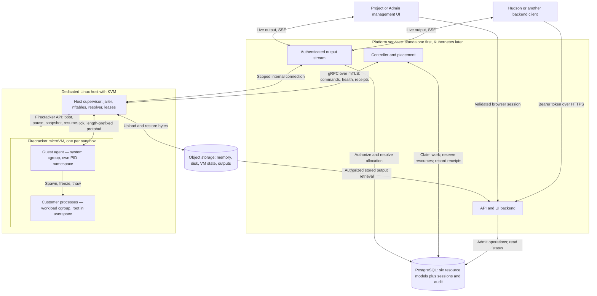
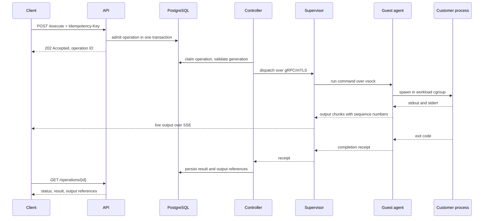

# Architecture

Status: partially implemented. The standalone API/controller, SQLx storage, real supervisor/guardian, guest execution/files and clients have development evidence. Broader platform topology and the complete supported-host release gates remain planned; implemented scope is linked from the documentation index. This document owns component boundaries, technology choices, deployment topology, and isolation mechanisms. [Threat model](threat-model.md) owns the adversary model those mechanisms answer to, [alternatives](alternatives.md) owns why this system is built rather than adopted, and [performance](performance.md) owns the budgets the design must meet. Read [the documentation index](README.md) for the detailed contracts.

## Purpose and ownership

Hudson Sandbox is a general-purpose secure runtime for untrusted Linux workloads. Scripts, applications, build jobs, automation, and services use the same core interfaces; AI agents are one possible client. [Product goal](goal.md) owns scope and priorities, including the initial secure execution milestone before pause/resume.

**Hudson is the agent harness. Hudson Sandbox is a tool it calls.**

Hudson Sandbox provides APIs to create, execute, pause, resume, and destroy isolated Linux sandboxes. It also handles files, execution limits, operation status, and resource cleanup. Clients do not need to use Hudson or Temporal to call these APIs.

| Component | Responsibility |
| --- | --- |
| Hudson harness, in the `hudson` repository | Agent behavior, business permissions, approvals, budgets, credentials, and any durable tasks implemented with Temporal |
| Hudson Sandbox, in this repository | Authenticated sandbox APIs, operation records, placement, lifecycle controllers, snapshots, execution limits, and cleanup |
| Kubernetes | Deployment and scheduling of platform services; resource controls for the workloads it manages |
| Firecracker and the host supervisor | Individual microVMs, their host resources, and isolated execution |

**This repository has no Temporal dependency.** It does not implement agent workflows, business approval logic, or a second durable workflow engine. PostgreSQL-backed operations and focused reconciliation loops provide the sandbox lifecycle's asynchronous control.

Hudson may wrap sandbox API calls in Temporal Activities in its own repository. Those calls use the same operation IDs, status APIs, and cancellation contracts as any other client. A sandbox does not receive Temporal credentials or understand workflow history.

The parent context is Hudson's [product goals](https://github.com/hudson-infinity/hudson/blob/main/docs/goals.md) and [Rust decision](https://github.com/hudson-infinity/hudson/blob/main/docs/implementation-decisions/0001-rust.md). Those repositories are context, not dependencies for operating a self-hosted sandbox service.

## Client interfaces and agent integration

The service has four planned ways to use it. The HTTP API is the common boundary; SDKs, the CLI, and the management UI are clients of that boundary.

| Interface | Intended user | Responsibility |
| --- | --- | --- |
| HTTP API | Any application or harness | Authenticated lifecycle, execution, status, output, and file requests |
| SDKs | Application developers | Language-friendly functions and typed results over the HTTP API; Python, TypeScript and Rust in the first release |
| CLI | Humans, scripts, and agents with shell access | Parse commands, authenticate API requests, and present readable or structured results |
| Management UI | Project users and installation Admins | Browser views and actions through session-authenticated API routes |

```text
Custom harness ───────────────┐
Application → SDK ────────────┤
Agent shell tool → CLI ───────┼──→ Sandbox API → Controller → Host supervisor → microVM
Human terminal → CLI ────────┤
Browser → Management UI ─────┘
```

All clients share server-side permission, quota, and lifecycle enforcement. Backend/CLI requests use the applicable bearer credential; browser requests use the session boundary in [auth design](auth-design.md#api-and-browser-boundaries). They need not use identical route prefixes or credential types to reach the same lifecycle services. None of these client interfaces manages Firecracker directly or owns a separate scheduler. Output streaming and file upload/download are API capabilities, not additional integration layers.

For a custom harness such as Hudson, implement a harness tool that calls the API directly or through an SDK. The harness holds the project credential and returns concise operation results to its agent. No Hudson-specific identity service or Temporal dependency is added here.

For an agent with shell access, the integration is **agent shell tool → `hudson-sandbox` CLI → API**. Claude Code is one example: it can run commands and consume project instructions, as described in its [official overview](https://code.claude.com/docs/en/overview). Our planned integration installs the CLI in the agent's execution environment, configures the service URL and project credential, and provides short instructions for using it. The API and sandbox compute may be remote from that CLI.

Installing the CLI does not redirect the harness's built-in file edits or shell commands into our sandbox. The agent must explicitly use the CLI for remote execution and file transfers. Instructions help it choose the tool; they do not enforce isolation of other harness tools. A caller that needs all execution confined to our sandbox must enforce that through its harness configuration. A chat client with no custom-tool or shell integration cannot use the service merely because an HTTP endpoint exists.

**No MCP server is planned for the current scope.** We will deliver API-based integrations and the CLI first. This decision avoids an additional protocol adapter; it does not claim that CLI instructions or command output consume no agent context. It is recorded in [decision 0002](decisions/0002-no-mcp-server-initially.md) with an explicit revisit trigger, so it is reconsidered deliberately rather than by drift as agent clients standardize. The initial SDK languages, package distribution, and exact CLI syntax remain implementation decisions. [API contract](api-contract.md#sdk-and-cli-behavior) owns client request/result behavior, and [roadmap](roadmap.md) owns delivery sequencing.

## System and data flow



Customer processes never talk to anything outside the VM directly. Every command, byte of output, and file crosses the vsock channel to the guest agent, and every packet they send crosses the supervisor's filter. [Networking](networking.md) owns what is permitted to leave.

The controller polls/claims persisted work; PostgreSQL does not call it. The API returns an operation handle after admission. Output bytes use the streaming path or object storage, not the controller's work queue.

| Component | Responsibility |
| --- | --- |
| API/UI backend | Authentication, authorization, admission, status, sessions, and admin management |
| Streaming endpoint | Authorized output forwarding with bounded buffers; initially part of the API service |
| Controller and placement | Claim operations, reserve capacity, dispatch, and reconcile observations |
| Host supervisor | Firecracker/jailer, networking, local storage, resource limits, leases, and execution receipts |
| Guest agent | Process trees, files, output, and the controlled pause/resume handshake |
| PostgreSQL | Durable intent, ownership, reservations, receipts, sessions, and audit |
| Object storage | Large immutable snapshot components and bounded retained output |

The API and controller may initially share a binary. Privileged host setup stays a separate boundary. Guest messages are untrusted and cannot grant host authority regardless of the channel they arrive on.

### Data flow for one execute request



The client's HTTP request ends at the third step. Everything after it is durable work the controller owns, which is why a disconnected client neither cancels the command nor stops its output being retained. [API contract](api-contract.md#retries-and-admission) owns admission and retries; [lifecycle](lifecycle.md#create-and-execute) owns the evidence each step must record.

## Privilege layers inside a sandbox

[Decision 0003](decisions/0003-guest-root-with-our-kernel.md) settles what a customer controls. The layers below are the shape it produces, and most of this document's isolation claims depend on the lower ones staying ours.

```text
┌─ host ────────────────────────────────────────────────────────┐
│  supervisor (root)   jailer · nftables · DNS resolver         │  ← ours
│  ┌─ Firecracker + KVM ──────────────────────────────────────┐ │
│  │  ┌─ microVM ────────────────────────────────────────────┐│ │
│  │  │  guest kernel   modules off, lockdown on             ││ │  ← ours, pinned
│  │  │  init (PID 1)   starts the agent before user code    ││ │  ← ours
│  │  │  ┌──────────────────┬─────────────────────────────┐  ││ │
│  │  │  │ system cgroup    │ workload cgroup             │  ││ │
│  │  │  │ guest agent      │ customer processes, as root │  ││ │  ← theirs
│  │  │  │ own PID ns       │ cannot see the agent        │  ││ │
│  │  │  └──────────────────┴─────────────────────────────┘  ││ │
│  │  └──────────────────────────────────────────────────────┘│ │
│  └──────────────────────────────────────────────────────────┘ │
└───────────────────────────────────────────────────────────────┘
```

The customer owns everything in the workload cgroup and nothing below it. They install packages, write anywhere in their filesystem, and bind any port. They cannot load a kernel module, replace the boot path, or select a different kernel.

Two consequences worth stating together. The VM boundary, the jailer, the host's resource limits, and every networking rule are unaffected by guest root — a root customer is no closer to the host, to another project, or to the platform database than an unprivileged one. But the separation between the guest agent and the workload is *hardening*, not a boundary: a determined root customer inside their own sandbox can attempt to kill or impersonate the agent. The namespace and cgroup split raises the cost; it does not make it impossible. [Threat model](threat-model.md#what-we-do-not-promise) states that limitation directly, and [lifecycle](lifecycle.md#resume) requires a missing agent to fail the sandbox rather than be assumed benign.

## Selected stack

| Part | Choice | Use |
| --- | --- | --- |
| Implementation | Rust | API, controller, supervisor, guest agent, and shared protocol types |
| Public interface | HTTP/JSON with OpenAPI | Lifecycle, commands, files, status, and a separate authenticated output stream |
| Controller to supervisor | gRPC over mTLS, per-host certificates | Allocation commands, health, and execution receipts |
| Host to guest | vsock with length-prefixed protobuf | Commands, output, file transfer, and the pause/resume handshake |
| Output streaming | Server-sent events with a cursor | Live output, resumable from the client's last sequence |
| Client authentication | Opaque Project/Admin credentials over HTTPS | Separate scope validators, hashed storage, expiry, rotation, and revocation |
| Management UI | Same-origin UI with server-side sessions | Project/Admin access and audited administration; framework to be selected |
| Isolation | Firecracker with Linux KVM | One microVM per sandbox |
| Durable metadata | PostgreSQL | Ownership, desired state, placements, operations, receipts, and snapshot manifests |
| Database access | SQLx with explicit parameterized SQL | Rust connection pooling, transactions, and typed query results; no ORM |
| Artifact storage | S3-compatible object storage | Memory snapshots, disk snapshots, workspace exports, and output artifacts |
| Platform deployment | Standalone first; Kubernetes later | Sandbox API, streaming endpoint, and controllers |
| Compute hosts | Dedicated Linux nodes with KVM | Firecracker execution through the host supervisor |
| Observability | OpenTelemetry, Prometheus, Grafana | Instrumentation, metrics collection, and operational views |
| Harness coordination | Temporal, only in `hudson` | Durable agent tasks outside this service |

Pin the Rust toolchain, dependencies, Firecracker release, guest kernel, and images after the first host integration is validated. The supervisor gRPC boundary now uses pinned tonic/prost versions; [supervisor protocol](supervisor-protocol.md) owns its implemented transport and fake-host evidence. The reference deployment sends OpenTelemetry data to a collector, then Prometheus for metrics and Tempo for traces, with logs as JSON at every level; a self-hoster may point it elsewhere. [Supported configuration](compatibility.md) owns the host and guest envelope those choices assume.

Use PostgreSQL through [SQLx](https://github.com/transact-rs/sqlx), with explicit parameterized SQL rather than an ORM. This keeps transaction boundaries and locking visible for operation claims, lifecycle transitions, and capacity reservations. The proposed `sandbox-store` crate owns queries and database transactions; `psql` is an optional human administration client, not the backend integration. [Data models](data-models.md#database-access-and-migrations) owns query and migration conventions. SQLx is installed and backs the implemented admission, claim, and reservation storage; this does not establish runtime isolation.

PostgreSQL and object storage cover the initial persistence needs. Defer Redis, ClickHouse, elaborate scheduling, VM warm pools until measurements or product requirements justify them. Build the scoped Project/Admin management UI described in [auth design](auth-design.md) on the shared API/lifecycle services. Customer programs may use any language installed in their guest image.

Firecracker's host API supplies VM controls; the supervisor uses that interface rather than embedding a hypervisor. See [Firecracker's design](https://github.com/firecracker-microvm/firecracker/blob/main/docs/design.md).

## Deployment and placement boundary

Use the deployment pattern documented by [E2B](https://github.com/e2b-dev/runtime/blob/main/docs/ARCHITECTURE.md#deployment-topology): Kubernetes hosts platform services, while an orchestrator on each compute host manages individual Firecracker VMs. E2B is an architectural reference, not a dependency; [alternatives](alternatives.md) explains why we build on this pattern instead of adopting a product that implements it.

**An individual sandbox is not a Kubernetes pod in the initial design.** Kubernetes scheduling the API or supervisor does not automatically schedule or account for the VMs that supervisor creates. Our placement component reserves sandbox CPU, memory, and disk capacity; the host supervisor enforces those limits.

Start with standalone API/controller processes and one compute host, making placement a capacity check and reservation. Kubernetes deployment follows the verified single-host lifecycle. Add multiple eligible hosts later. Keep sandbox compute capacity dedicated, or explicitly reserve it from other Kubernetes workloads, so two schedulers cannot allocate the same resources independently. Account for host overhead and bounded image caches; exclude draining or unhealthy hosts. Reserve local writable/restore disk alongside CPU/RAM, and reserve snapshot staging space and upload slots before freezing a VM. Expired leases alone cannot free disk bytes or stop an uploader.

Capacity accounting must be able to represent cached snapshot bytes as a category distinct from allocation disk and snapshot staging, even before any cache exists. A host-local snapshot cache is the most likely answer to cross-host restore latency, and retrofitting a third category into reservation arithmetic later is avoidable work. See [performance](performance.md#constraints-on-designs-we-are-choosing-now).

Kubernetes may deploy a privileged launcher for the host supervisor, but its exact packaging must be validated separately. The supervisor's host privileges never extend to customer processes. Node eviction, draining, or termination must coordinate with active sandboxes; replacing a service pod is not evidence that guest memory was saved.

Node-pool provisioning and autoscaling require a provider integration and sandbox-capacity signals; they are not supplied merely by deploying the API on Kubernetes. Initially provision the single host explicitly. A future one-pod-per-sandbox integration can be evaluated without changing the public API, but is not required for the first version.

A host is a machine; an allocation is a sandbox's reservation on that machine. Placement starts with a capacity check on one host and later chooses among compatible hosts. [Data models](data-models.md) owns reservation fields and constraints; [lifecycle](lifecycle.md) owns safe release and replacement rules.

## Authentication and UI boundary

Authentication is required for local, self-hosted, and Hudson deployments. Project access is scoped to one project; Admin access manages the installation. Browser sessions derive from validated credentials. Internal host credentials are separate. [Auth design](auth-design.md) is authoritative for permissions, sessions, and revocation; [UI design](ui-design.md) owns screens and user flows.

Hudson owns its users, agent tasks, approvals, and business credentials. The sandbox does not call Hudson to validate access. An optional external tool gateway belongs to the caller's trusted infrastructure, not this service.

## Isolation and data protection

These are the mechanisms. [Threat model](threat-model.md) states which adversary each one answers, and which attacks we explicitly do not defend against.

Use Firecracker jailer, supported seccomp filters, per-VM cgroups/namespaces, restricted host sockets, immutable verified templates, and a private writable filesystem per sandbox. Harden host setup using [Firecracker's production guidance](https://github.com/firecracker-microvm/firecracker/blob/main/docs/prod-host-setup.md).

Inside the guest, the mechanisms that make root survivable are kernel-enforced and therefore depend on the kernel staying ours: module loading compiled out, kernel lockdown enabled, the guest agent in its own PID namespace and `system` cgroup, and the agent's control socket unreachable from the workload namespace. Treat all of it as raising cost rather than closing the boundary.

Enforce deny-by-default egress through host-controlled networking and filtering, with an allowlist of address ranges and ports rather than names, a host-side resolver that refuses unapproved queries, and no inbound path into a sandbox. [Networking](networking.md) owns the full policy, including why domain-shaped rules and forwarding resolvers are both rejected. Validate it with the adversarial tests listed there.

Keep privileged file operations symlink-safe and reject archive/path traversal. Bound message sizes, process output, and uploads. Guest root must not imply access to host paths, devices, orchestration credentials, or another sandbox.

Snapshots contain customer memory and may contain sensitive data. Encrypt and restrict them to their owner, verify integrity, and enforce retention/deletion. Keep tenant data out of reusable base templates. Revalidate current sandbox access on resume rather than trusting credentials restored from memory.

Explicit shell execution is allowed only inside the guest. The host never interpolates customer input into privileged shell commands. Guest content is not hosted on the management UI origin. Snapshot compatibility and process-freeze requirements are owned by [lifecycle](lifecycle.md).

## Proposed code layout

```text
crates/
  sandbox-protocol/     # Request, event, receipt, and error types
  sandbox-api/          # Authentication, admission, status, and OpenAPI
  sandbox-controller/   # Operation claims, placement, lifecycle reconciliation
  sandbox-supervisor/   # Host resources, jailer, Firecracker, snapshots, leases
  sandbox-guest/        # Commands, files, and bounded guest reporting
  sandbox-store/        # SQLx queries, PostgreSQL transactions, and object storage
  sandbox-client/       # Generated Project requests/models and bounded HTTPS client
  sandbox-cli/          # HTTP API client for humans, scripts, and agent shell tools
images/                 # Guest image and kernel build definitions
deploy/                 # Kubernetes services and dedicated Linux host setup
tests/                  # Integration, recovery, isolation, and protocol tests
```

There are no sandbox Temporal workers, workflow crates, or Temporal service manifests. Introduce crate boundaries only where dependency, testing, or privilege separation benefits justify them.

This layout is a proposal; the directories and binaries do not exist yet. The UI framework and its source layout remain undecided.

## Open decisions and verification

Choose exact dependency versions, the frontend framework, and host packaging during implementation. The supported host configuration is in [supported configuration](compatibility.md); use a remote Linux host for real VM testing from macOS. No performance or isolation guarantee is established by this diagram.

Validation: integration and isolation tests are not written yet. Required gates and planned delivery are in [roadmap](roadmap.md); lifetime/recovery checks are in [lifecycle](lifecycle.md#acceptance-checks); adversarial tests are listed in [threat model](threat-model.md#required-validation); latency and size budgets are in [performance](performance.md).

The guest agent's separation from frozen customer process groups is the least proven element of this design and is not settled by any document here. [Roadmap](roadmap.md#feasibility-spikes-phase-0) makes proving it on real hardware a Phase 0 spike, ahead of the pause/resume phase that depends on it.
