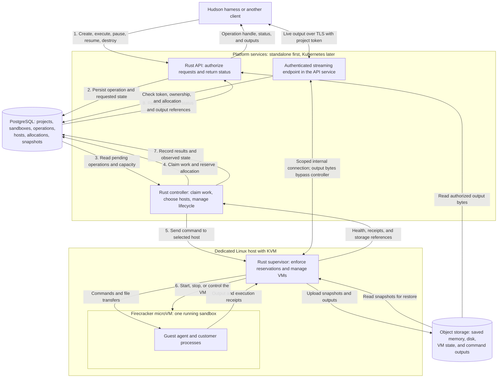

# Hudson Sandbox architecture and data flow

Status: proposed architecture, not an implemented or tested runtime. Start with one compute host; the same model supports placement across multiple hosts later.

**Hudson asks for a sandbox. Our API records the request. Our controller reserves space on a server. The server's supervisor starts the sandbox using Firecracker.**

Hudson is the harness; this service is a tool. Any Temporal workflows stay in Hudson. The sandbox service manages its own operations using PostgreSQL and focused background controllers.

## The whole system

Read the numbered arrows from the client down to the sandbox. The arrows back carry results; the storage arrows carry large files.



The controller reads and claims work from PostgreSQL; the database does not call the controller. The API returns an operation handle after admission, so the caller does not need to keep a connection open until the work finishes. It can poll that operation for progress and results.

Initially run the API/controller, PostgreSQL, object storage, and one dedicated Linux compute host without requiring Kubernetes. Deploy platform services on Kubernetes after the single-host lifecycle works. Individual sandboxes remain managed by our supervisor, not Kubernetes pods. PostgreSQL and object storage are logical dependencies here; their hosting provider is not selected yet.

## Simple project-token authentication

Token authentication is the default for hosted and self-hosted deployments. The explicit local-development exception below only skips the client token check.

Hudson's backend sends `Authorization: Bearer <project-api-token>` over HTTPS. The API validates the token, resolves its project, checks that the project is active, and checks resource ownership on every request. A caller-supplied project or sandbox ID never grants access. User login and business permissions stay in Hudson.

Use opaque tokens with a cryptographically random 256-bit secret. Store only token hashes and lifecycle metadata on the project, never the raw token. Support expiry, revocation, and two active tokens per project so rotation can overlap. Provision and rotate them through operator tooling initially; there is no login UI, OAuth flow, JWT requirement, or role-management system in this service. See [token storage](data-models.md#1-projects--ownership-and-limits) for the small record inside `projects`.

The project token authorizes that project's sandbox API operations. It does not grant host administration. Keep customer tokens in the trusted client backend, out of browser code, URLs, logs, guest memory, and snapshots. Internal API/controller-to-supervisor calls use separate operator-managed service credentials over authenticated TLS, bound to the intended service/host; project tokens are never forwarded to the supervisor or guest.

Revocation blocks new requests and new execution dispatch under that token. It does not undo an already-executed command or abandon required stop/cleanup work. Preserve admitted receipts and use the explicit cancellation/destroy APIs when stopping existing work is intended. Recheck current project policy at resume. This follows the baseline of HTTPS and per-endpoint authorization in [OWASP REST guidance](https://cheatsheetseries.owasp.org/cheatsheets/REST_Security_Cheat_Sheet.html).

### Local development without API tokens

Contributors can opt into a standalone development profile with one default project. Proposed configuration (not implemented yet):

```dotenv
RUN_MODE=development
AUTH_MODE=disabled
API_BIND=127.0.0.1:8080
```

The normal default is `AUTH_MODE=token`. Unknown values, missing token configuration in token mode, or an unavailable authentication store fail closed; they never activate development mode. Changing auth mode requires an operator-controlled process restart, not an API request or header.

In disabled mode, bootstrap one marked development project in a dedicated local-development database and reuse its generated ID across restarts. If the database contains ordinary projects, refuse this profile rather than granting access to their records. Every local request maps to the one development project; caller-supplied IDs cannot select another owner. Use the same ownership checks, idempotency rules, quota accounting, and lifecycle controllers as token mode. No token is issued or needed, including for output streaming. The mode grants anyone who can reach this listener full API access within that development project.

Require the standalone development profile and a literal loopback bind (`127.0.0.1` or `::1`) for both the API and streaming listener. Refuse wildcard/non-loopback listeners and hosted/Kubernetes deployment profiles. Plain HTTP is allowed only on this loopback listener. Validate local Host headers and loopback peers; reject browser Origin headers and forwarded/proxy headers in this mode. Do not publish the listener through a reverse proxy, public tunnel, or container port mapping; headers alone cannot detect a proxy that deliberately hides itself. Use token mode for shared or remotely exposed installations.

Record local requests as `local_development`, separate from internal service operations. Before dispatch and periodically during streams, confirm the mode, project identity, and active project policy still match. Switching back to token mode must not dispatch pending development requests automatically; leave them blocked for explicit operator resolution. Stop/reconciliation/cleanup remains available under service authority.

Firecracker/jailer isolation, guest restrictions, network policy, limits, supervisor authentication, and database/object-storage credentials remain required. Print a clear startup banner identifying the unauthenticated local listener. This mode is a contributor convenience, not a second path into deployed project resources.

## Live output without routing bytes through the controller

The following token rules apply to normal deployments; local development uses the single-project context above with the same ownership and stream-lifetime checks.

The initial streaming endpoint lives in the API service; it does not require another deployment. After a command is admitted, Hudson's backend connects using the same project token. The endpoint verifies the operation's ownership and current allocation, then opens an authenticated internal connection to the supervisor. The supervisor sends output from the guest directly along this path:

```text
Guest → supervisor → authenticated streaming endpoint → Hudson backend
```

The controller still dispatches commands and records receipts/results. Streaming is initially read-only output for an existing operation, not another route to execute commands or send signals. Use sequence cursors, bounded buffers, and backpressure; signal a gap if requested history has expired rather than silently dropping output. Durable output remains in object storage with references on the operation. A stream disconnect or reconnect never reruns the command or cancels it automatically.

Reauthorize every connection and recheck token/project state at most every 30 seconds while connected; fail closed on a failed check and close at token expiry. Pause closes the stream with its last cursor; resume requires a fresh authorized connection to the new allocation. A future direct-browser stream would use a short-lived, stream-scoped credential; that feature is deferred, so the project token stays server-side.

## Where the six models fit

| Model | Plain meaning | Who uses it |
| --- | --- | --- |
| `projects` | Who owns the sandbox and what limits apply | API checks access; controller enforces project quotas |
| `sandboxes` | The lasting environment identity and its current state | API and controller track it through its whole lifetime |
| `operations` | What the caller asked us to do and what happened | API admits requests; controller claims work and records receipts/results |
| `hosts` | Which servers exist, their capacity, and their health | Controller chooses eligible hosts using supervisor observations |
| `allocations` | Which sandbox has reserved how much space on which host | Controller reserves capacity; supervisor enforces it and confirms release |
| `snapshots` | Where a sandbox's saved state lives | Controller publishes verified metadata; supervisor uploads or restores bytes |

A project owns a sandbox. That sandbox has operations, historical allocations, and snapshots. Each allocation points to one host. Each snapshot points to the allocation it was captured from and the pause operation that created it.

## Host versus allocation

**A host is a server. An allocation is a reservation on that server.** The allocation record is not another running service or another VM around the sandbox.

```text
Host 1: 16 CPUs and 64 GiB schedulable RAM
├── Allocation A → Sandbox Alice: 2 CPUs and 4 GiB
├── Allocation B → Sandbox Bob:   4 CPUs and 8 GiB
└── Available:                   10 CPUs and 52 GiB
```

These example capacities already exclude resources reserved for the host OS and supervisor. Creating a sandbox that needs 2 CPUs and 4 GiB can use Host 1. If Host 1 lacks room, the controller looks for another healthy, compatible host. Initially there is only one provisioned host; insufficient capacity is queued within a deadline or rejected explicitly. Adding machines automatically is a later provider integration.

The CPU/RAM example omits another required limit: local disk. Allocations also reserve writable and restore disk space. Before freezing a VM for pause, reserve snapshot staging bytes and an upload slot on the source host. Bound concurrent uploads; leave the sandbox runnable while waiting for this admission. Count allocation disk and unreleased snapshot staging together against schedulable disk, excluding OS space and a bounded image cache. An expired lease alone does not prove local files are gone.

The controller checks capacity and writes reservations in a transaction before asking the supervisor to start or snapshot a VM. The supervisor also checks actual free disk before writing. These checks prevent concurrent requests from over-reserving capacity. An unreachable host's reservations remain counted until termination or fencing is confirmed; disk reservations remain until file cleanup or host storage retirement is confirmed.

## Create and execute: request to result

1. **Client → API:** request a sandbox with an allowed image digest, resource limits, and an idempotency key. Authentication determines its project.
2. **API → PostgreSQL:** validate access and request limits, then create the sandbox and create-operation records in one transaction. Return their IDs. A retry with the same key and payload returns the same operation.
3. **Controller → PostgreSQL:** claim the operation, select an eligible host, recheck quotas/capacity, and reserve an allocation with a new sandbox generation.
4. **Controller → supervisor:** send the allocation, image digest, limits, operation identity, and ownership revisions. The supervisor rejects stale ownership, prepares networking/storage, verifies the image, and starts Firecracker through the jailer.
5. **Supervisor → controller → PostgreSQL:** confirm guest readiness. The controller records the running sandbox and successful create operation. A start request alone is not proof of readiness.
6. **Client → API:** request execution. The API creates an execute operation. The controller dispatches it to the sandbox's existing allocation; executing a command does not allocate another VM.
7. **Guest → supervisor → storage/controller:** run the command, capture bounded output, upload stored outputs, and report receipts. The controller persists result metadata and output references on the operation.
8. **Client → API:** inspect the operation and retrieve authorized output bytes by operation and output name. Large output bytes remain in object storage, not database rows.

The public API is HTTP/JSON. Internal controller-to-supervisor transport remains an implementation decision; the host-to-guest channel is initially proposed as vsock. Customer code runs inside the guest, and the guest receives no PostgreSQL or object-storage credentials from this design.

## Pause: save first, then release compute

1. The API records a pause operation. The controller serializes the transition and prevents new command dispatch for that sandbox.
2. The controller reserves a snapshot ID, staging bytes, and an upload slot for this pause operation. The guest agent freezes all customer process groups while keeping its management process separate; the supervisor then quiesces/freezes the VM and captures matching memory, disk, and VM state. This saved process freeze is required for controlled resume.
3. The supervisor uploads the components to private object storage and returns verified object references and digests. Incomplete uploads cannot be published as resumable snapshots.
4. The controller verifies the complete manifest and transactionally publishes its snapshot metadata and the sandbox's current snapshot reference in PostgreSQL.
5. After publication, the supervisor stops the VM and reclaims its compute/network and allocation disk resources. The controller records confirmed allocation release and marks the sandbox paused. Snapshot staging cleanup is tracked separately until its files are deleted; those bytes stay reserved meanwhile.

The sandbox row and its ID remain. Its old allocation becomes released, so the host's capacity can serve another sandbox. The snapshot's bytes remain in object storage. Freezing Firecracker alone does not release compute.

## Resume: same sandbox, new reservation

1. The API records a resume operation and pins the sandbox's current published pause snapshot. It does not choose an arbitrary older snapshot.
2. The controller confirms the previous VM cannot still execute, chooses a compatible host with space, and creates a new allocation ID and increasing generation.
3. The supervisor restores the disk and memory with the VM initially paused and host egress blocked. The snapshot already contains frozen customer process groups; the guest agent is outside those groups.
4. The supervisor resumes the VM so the guest agent can reconnect, while customer processes remain frozen. Authenticate the new management session and bind it to the current allocation/generation. Old connections are not reused; Firecracker resets vsock connections during snapshot/resume. See [Firecracker snapshot support](https://github.com/firecracker-microvm/firecracker/blob/main/docs/snapshotting/snapshot-support.md#vsock-device-reset).
5. Refresh management credentials, synchronize time as required, apply current project/network policy, and reconcile original command deadlines/cancellation. Arrange termination of expired or cancelled process groups before they can execute again. No customer process is released until the handshake is acknowledged; if the gate cannot be proven, stop/fence the partial restore and report failure or uncertainty.
6. With the current controller claim, supervisor epoch, and allocation generation validated, release only eligible customer process groups. Persist the release acknowledgement and record readiness and successful resume. A lost acknowledgement requires reconciliation, never another restore running alongside this one.

The guest image must enforce separation between the agent and customer processes: customer privileges cannot control the management agent or bypass its process-freeze boundary. Reject resumable images that cannot meet this contract. A frozen whole VM cannot run the reconnect handshake; the separate guest process gate is what makes that handshake possible.

```text
Before pause: Sandbox S → Allocation A → Host 1
Paused:       Sandbox S → Snapshot Q in object storage; no live allocation
After resume: Sandbox S → Allocation B → Host 1 or another compatible host
```

An already-running script resumes under its original execute-operation ID. We do not submit it again. A host crash does not guarantee recovery of work since the last snapshot, and the service never silently restores old state that could repeat external side effects.

## Destroy and recovery

Destroy records an operation, prevents new execution/resume, and stops the VM if one exists. Only confirmed release makes its capacity available again. The sandbox becomes a permanent tombstone; snapshot/output cleanup follows retention policy and is tracked independently of compute release.

If the API or controller restarts, pending operations and reservations remain in PostgreSQL. A replacement controller acquires a new claim and reconciles supervisor receipts before continuing. Host supervisors enforce local leases and deadlines. Unknown execution outcomes are reported and investigated through reconciliation rather than blindly rerunning customer commands.

| Interrupted boundary | Persisted evidence | Recovery action |
| --- | --- | --- |
| Create reserved, readiness unknown | Operation, allocation/generation, dispatch receipt | Inspect that incarnation; adopt confirmed readiness or confirm teardown before replacing |
| Execute dispatched, result missing | Stable operation ID and dispatch/acknowledgement receipts | Query guest/supervisor state; return unknown if unprovable, never blindly execute again |
| Pause upload incomplete | Snapshot ID, upload attempt, staging reservation, guest freeze phase | Reconcile the original VM and uploads; continue safely or explicitly roll back the freeze under current policy |
| Snapshot uploaded, publication uncertain | Immutable manifest/digests and snapshot record | Verify and publish once; object presence alone is not readiness |
| Snapshot published, VM stop unconfirmed | Published snapshot and unreleased allocation | Finish stop/fencing and resource cleanup; do not start a replacement yet |
| Restore started, guest handshake incomplete | Pinned snapshot, new allocation, handshake phase | Keep customer processes frozen; reconnect or confirm teardown, never release them speculatively |
| Customer processes released, readiness reply lost | Release receipt bound to allocation/generation | Reconcile the same VM and record outcome; do not restore a second copy |
| Destroy stopped VM, cleanup incomplete | Destroy operation, stop evidence, pending cleanup references | Continue cleanup; retain outstanding disk reservations and destruction tombstone |

Persist intent before each external action and confirmed evidence afterward. Every transition validates the current claim revision and allocation generation. Failure-injection tests must interrupt each row's boundary before the first complete milestone is accepted.

For the full fields and database constraints, see [data models](data-models.md). For retry keys and stable IDs, see [identities and resources](identity-and-resources.md). For component implementation, deployment, and validation details, see [implementation](implementation.md).
