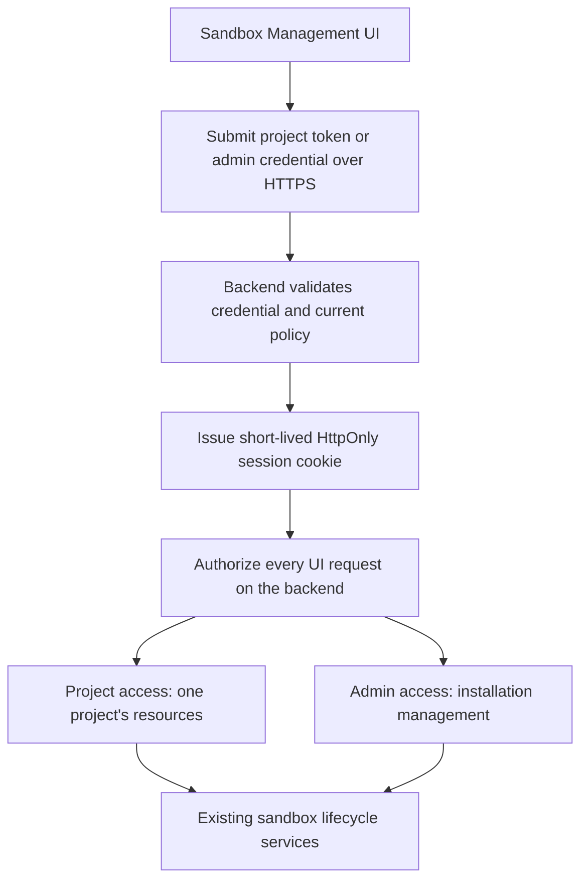

# Authentication and management UI access

Status: proposed design, not implemented. This document defines **Project access** and **Admin access** for the Sandbox Management UI and APIs. It extends [architecture](artitecture.md) and [data models](data-models.md).

Project access manages one project's sandboxes. Admin access manages the entire installation. Every deployment, including local development, requires authentication. There is no auth-disable switch or implicit local identity.

## Two access levels

| Capability | Project access | Admin access |
| --- | --- | --- |
| View sandboxes, operations, output, and snapshots | Own project | All projects, with explicit target selection |
| Create/execute/pause/resume/destroy and cancel operations | Own project within limits | Any selected project, through the same lifecycle services |
| View resource usage and limits | Own project | Whole installation and each project |
| Create projects and change quotas | No | Yes |
| Issue, rotate, and revoke project API tokens | No | Yes |
| View host health/capacity and request maintenance drain | No | Yes |
| Read administrative audit history | No | Yes |
| Read existing plaintext credentials | No | No; hashes only |

Admin access does not skip idempotency, snapshot verification, process isolation, resource accounting, or stale-controller checks. Changing a quota is an explicit administrative action. Draining a host means preventing new placements and following the normal lifecycle; it does not automatically destroy its sandboxes.

There are no custom roles, per-user memberships, or permission editor initially. A Project credential is intentionally powerful within its project, including reading outputs and running code. Applications such as Hudson enforce their own finer user permissions before calling this service.

## Credentials and setup

### Project credentials

Keep the existing opaque project tokens: a random 256-bit secret, nonsecret lookup identifiers, and only a SHA-256 hash plus expiry/revocation metadata stored in `projects.api_tokens`. Verify the hash in constant time, then check current project status and ownership. At most two active project tokens support rotation. Show a newly generated token once; it cannot be recovered afterward.

Hudson's backend or another application's backend sends the token in an Authorization bearer header over HTTPS. No call to Hudson's identity system is needed. Project credentials cannot authenticate to admin routes, even if the client submits `role=admin`, changes a URL, or knows another project's ID.

### Admin credentials

Use a separate opaque credential with a random 256-bit secret. Local setup, running under installation-administrator authority, creates the first named admin credential. Store its ID, label, hash, expiry, revocation state, and configuration revision in administrator-controlled deployment configuration. Never store its raw value in project rows, repository files, or UI assets.

Admin credentials have a separate format/lookup namespace and validator from project tokens. Labels identify credentials for audit, not verified human identities. A shared admin credential cannot provide individual-person attribution. Separate named credentials can be provisioned when needed, without adding user accounts.

Admin credential provisioning/rotation stays in local admin tooling initially; project-token management is available through the authenticated Admin UI/API. Configuration changes must reach every API/controller replica; a replica with stale credential configuration must stop serving/dispatching until updated. Report fleet-wide revocation complete only after all serving replicas have acknowledged it or have been removed from service. Internal supervisor credentials remain a third, separate service-only trust boundary and cannot log into the management UI.

Self-hosting setup is: provision the initial admin credential locally → open the UI and log in → create a project → issue a project token → save it in the calling application's backend secrets. Local development uses this same process with HTTPS and a trusted development certificate. There is no public unauthenticated project/admin bootstrap endpoint.

## Browser login and session flow

The UI offers **Project access** and **Admin access** login options. Selecting one chooses which credential validator to call; it does not assign a role. The backend derives access from a successfully validated credential.

1. Serve the management UI and its `/ui-api` backend from the same trusted origin. Static login assets are public; they contain no project data or credentials.
2. A login form sends the credential only to its fixed same-origin endpoint. It is briefly present in the form, then cleared. Never retain it in localStorage, sessionStorage, URLs, analytics, logs, or frontend environment variables.
3. Validate the credential and create a fresh cryptographically random 256-bit session secret. Store only its hash with its originating credential ID/type and effective project scope. Invalidate any prior session presented during login; do not upgrade a Project session into Admin in place.
4. Set `__Host-hsb_session` with `Secure; HttpOnly; SameSite=Strict; Path=/` and no Domain attribute. Use an initial absolute lifetime of 1 hour and idle timeout of 15 minutes, capped by the credential's expiry. No refresh token or automatic extension past the absolute lifetime.
5. For every authenticated UI request, resolve the session server-side, enforce both timeouts, and revalidate the originating credential and current policy. Never trust a role or project ID supplied by browser state. If session/credential storage is unavailable, deny access.
6. Logout revokes the server session and clears the cookie. Revoking a credential invalidates all sessions derived from it. Project suspension blocks Project sessions and new customer execution; Admin may still inspect and perform authorized stop/cleanup.

Use a maintained session implementation where possible. Cookie attributes, server-side expiry, and session-ID renewal follow [OWASP session guidance](https://cheatsheetseries.owasp.org/cheatsheets/Session_Management_Cheat_Sheet.html). These timeout values are our initial choices, not requirements from that source.

## API and browser boundaries

| Surface | Accepted authentication | Responsibility |
| --- | --- | --- |
| `/v1/...` | Project bearer token | Existing project-scoped automation API |
| `/admin/v1/...` | Admin bearer credential | Installation API; project resource actions explicitly name a target project |
| `/ui-api/session/project` and `/ui-api/session/admin` | Credential exchange at login | Validate credential before creating a session; rate-limit attempts |
| `/ui-api/...` | Valid server-side session | Project or Admin UI requests, with backend scope enforcement |
| Internal supervisor endpoints | Dedicated service authentication | Host control; reject project/admin browser credentials |

Paths are proposed, not implemented. Bearer endpoints do not accept session cookies as fallback, and UI data endpoints do not accept bearer credentials as fallback. Reject ambiguous authentication inputs. A Project session cannot use Admin UI routes; Admin may select a project explicitly for project operations. Return `401` for invalid credentials/sessions, `403` for a valid principal with the wrong access level, and nonrevealing `404` for inaccessible project resources.

Cookie-authenticated mutations, including logout, require a session-bound CSRF token in a custom header plus exact trusted-Origin validation. GET requests never mutate state. Login itself requires exact trusted Origin and JSON content type and rejects cross-origin requests; it cannot rely on a session CSRF token that does not exist yet. Do not enable credentialed cross-origin access. See [OWASP CSRF guidance](https://cheatsheetseries.owasp.org/cheatsheets/Cross-Site_Request_Forgery_Prevention_Cheat_Sheet.html).

Use login rate limits and generic invalid-credential responses. Return `Cache-Control: no-store` on session, token-issuance, and sensitive UI responses. Render guest output as untrusted text. Never serve customer HTML or sandbox ports on the management origin, where they could access authenticated UI endpoints. Use a restrictive content security policy and avoid third-party scripts on credential entry pages.

## Live output and revocation

Backend clients retain project-token streaming. The management UI uses a same-origin session-authenticated output stream scoped to an existing operation; it does not send the original project/admin credential. Validate Origin at stream establishment and authorize the selected operation/allocation. Streams cannot execute commands or change privileges.

Recheck session validity, source credential, and applicable project policy at most every 30 seconds. Close at expiry, logout/revocation detection, or failed checks. Passive output does not reset the idle timeout; deliberate authenticated UI activity may update it. Reconnect reauthorizes and uses the existing cursor/operation. Pause ends the connection; resume can reconnect to the new allocation without executing a duplicate command.

This supports our same-origin management UI. Embedded third-party browser access and dedicated stream-scoped credentials remain deferred.

## UI structure

Project access opens directly into its project: **Sandboxes**, **Operations**, **Snapshots**, and **Usage**. Sandbox detail includes commands/output, state, limits, pause/resume/destroy actions, and snapshot history. Host addresses and other projects are not exposed.

Admin access adds **Projects**, **Hosts**, and **Audit** plus a visible target-project selector. Project pages include quotas and token issuance/revocation. Host pages show health, reserved/available resources, and maintenance drain progress. Display a persistent Admin access indicator. Require explicit confirmation for destroy/revoke actions in the UI; authorization and lifecycle validation still happen on the server.

Both interfaces call the same lifecycle services. Admin actions do not directly edit a sandbox state to pretend that a VM has stopped or a snapshot is ready. Hudson's conversations, agent tasks, approvals, and deliverables remain in the Hudson UI.

## Storage and audit

Keep the six sandbox resource models. Add two supporting security tables for sessions and administrative audit; do not force session lists into project JSON or create a user/role directory.

| Record | Main fields |
| --- | --- |
| `ui_sessions` | ID, unique session hash, principal kind (`project` or `admin`), credential ID/config revision, nullable project ID (required for Project), CSRF verifier, created/last-activity/absolute-expiry/revoked timestamps |
| `audit_events` | ID, time, principal kind/credential ID, session ID if applicable, action, target project/resource, request ID, safe change summary, outcome, resulting operation/reference; mutation idempotency key and request digest where applicable |

Sessions store no raw credentials and confer no authority beyond their live source credential. Delete expired session records after operational retention. Audit records contain no token/session secrets, credential hashes, CSRF secrets, or guest output. Record admin reads of customer output as well as administrative mutations. Authentication failures use redacted security logs and never trust a submitted credential ID as a verified actor.

Persist the accepted administrative change and its audit receipt in the same PostgreSQL transaction. For lifecycle actions, that transaction admits the normal operation and links its ID; later outcome events record completion/failure. If the audit write fails, the administrative mutation is not admitted. Host drain persists intent and reports progress; an accepted drain is not a completed drain.

Sandbox mutations keep the existing `(project_id, idempotency_key)` contract, including Admin actions on a project. For project/token/quota/host management mutations, use an atomic audit/admission receipt unique by `(admin_credential_id, idempotency_key)` with a request digest. Identical retries return the existing safe result; changed requests conflict. Keep compact deduplication receipts after detailed audit retention expires. Never cache a newly issued plaintext token in the receipt: if its one-time response is lost, return the issued key's metadata and explicitly revoke/reissue with a new request rather than issuing another token on a retry.

Operations gain a server-assigned `initiator_kind` (`project`, `admin`, or `service`) alongside `initiator_key_id` and optional session ID. Recheck the applicable credential before new execution; a revoked/expired browser session alone does not cancel an already-admitted task. Required stop and cleanup run under authenticated service authority. Null key IDs never imply service authority. Admin actions retain the original target project's ownership and cannot bypass suspension/resource/lifecycle rules.

## Acceptance checks

1. Project tokens/sessions cannot access another project's resources or any Admin route, regardless of submitted role/project fields.
2. Admin credentials cannot authenticate as internal supervisors; service credentials cannot log into the UI.
3. Login derives access on the backend, renews session identity, and stores no raw credential in browser persistence or database records.
4. Expiry, logout, credential revocation, and Project suspension take effect on requests and within the stream recheck bound across replicas.
5. Cookie-authenticated mutations require CSRF and Origin checks; bearer-only endpoints do not accept cookie fallback.
6. Admin changes have atomic audit/admission receipts, respect retries, and use ordinary lifecycle controllers. Lost token-issuance responses never silently create a second key.
7. Local development and self-hosting require the same credentials/session validation; failures never enable unauthenticated access.
8. Guest HTML/output cannot execute on the management origin. Logs and traces redact login bodies and authentication/session headers.

Implement setup, validators, session/audit persistence, and shared policy enforcement before wiring the UI actions. This design selects two access levels and their enforcement; frontend framework, styling, concrete migrations, and deployment wiring remain implementation choices.
