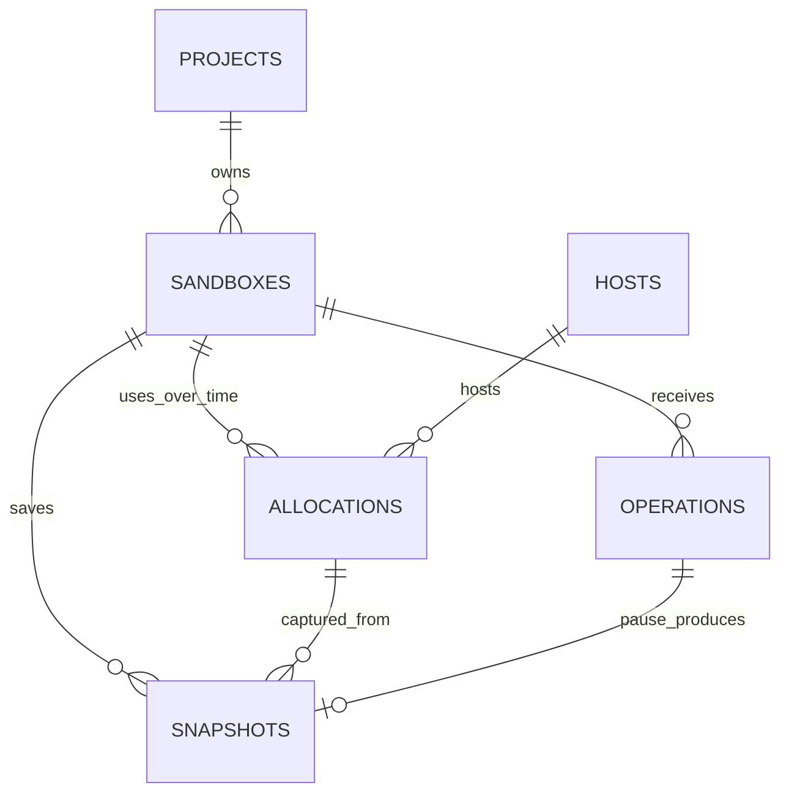

# Data models, IDs, and storage

Status: selected logical design; migrations and tests pending. This document owns fields, relationships, identity formats, database constraints, and object-storage references. [Auth design](auth-design.md) owns credential/session enforcement; [API contract](api-contract.md) owns retry behavior; [lifecycle](lifecycle.md) owns transitions and completion evidence.

There are **six sandbox resource tables** plus **two supporting UI security tables**, not a user/role directory. All schemas below are proposals, not executable migrations.

## ID format and identity

**One sandbox keeps one identity through create, execute, pause, and resume.** A snapshot identifies saved state. An allocation identifies one attempt to run that sandbox as a VM. An operation identifies one requested action.

Destroy permanently retires the sandbox ID. Creating another sandbox always creates a new ID, even when its display name or image is the same. Copying saved state into a different sandbox would be a future explicit fork operation, not ordinary resume.

Hudson is an ordinary client. None of these identities depend on a Hudson run, a Temporal workflow, a Kubernetes pod, an IP address, or a guest process ID.

Use a short resource prefix followed by a canonical lowercase, hyphenated UUIDv7:

```text
sbx_01996110-7c00-7000-8000-000000000001
```

This is an illustrative valid-format ID. The prefix helps people distinguish resources in API responses and logs. Generate the UUID once in the trusted service using an established Rust UUID implementation. Store its underlying value in PostgreSQL's `uuid` type; attach or remove the fixed prefix at the API boundary. There is no separate public-to-internal ID mapping table.

UUIDv7 carries a millisecond timestamp and supports time-oriented index locality. It does not establish strict ordering across machines, prove freshness, or act as a secret. Keep explicit timestamps, revisions, and generations for those purposes. Sources: [RFC 9562, UUIDv7](https://www.rfc-editor.org/rfc/rfc9562.html#section-5.7), [PostgreSQL UUID type](https://www.postgresql.org/docs/current/datatype-uuid.html).

The parser accepts the exact resource prefix and canonical UUIDv7 format; reject wrong types, truncated IDs, malformed values, and alternate spellings. Keep database uniqueness constraints and handle the unlikely generation collision before publishing an ID. Do not hand-roll the generator, truncate random bits, or make IDs out of database row counts.

IDs are opaque identifiers, never bearer credentials. They may reveal approximate generation time. Authorization applies to every lookup regardless of whether the identifier is known, guessed, or supplied in a storage path.

The notation `<uuidv7>` below represents the full canonical UUID, not a literal API value.

| Record | API format | Lifetime and purpose |
| --- | --- | --- |
| Project | `prj_<uuidv7>` | Stable tenant boundary for ownership, quotas, and authentication |
| Sandbox | `sbx_<uuidv7>` | Stable environment identity across pause/resume; never reused after destroy |
| Operation | `op_<uuidv7>` | One create, execute, pause, resume, destroy, or other mutating request |
| Snapshot | `snp_<uuidv7>` | One immutable, completed save of memory, disk, and VM state; reserved while preparing |
| Allocation | `alc_<uuidv7>` | One reserved VM incarnation on one host; new on initial start, resume, or replacement |
| Host | `hst_<uuidv7>` | Internal registered machine identity; replacement/reprovisioning gets a new ID |

Most clients need only project, sandbox, operation, and snapshot IDs. Images are addressed by authorized immutable digests; outputs are retrieved through their producing operation. Allocation and host identities are internal/admin details. Host addresses are not exposed in ordinary sandbox responses.

Avoid extra resource types initially:

- An executed command is an operation of kind `execute`; do not add a second command/job ID for the same action.
- A controller attempt is `(operation_id, attempt_number)`, with a positive incrementing number. Its receipts live on the operation; it does not need a separate table or globally unique ID.
- A sandbox's generation is an increasing integer, not another UUID. It orders allocation replacements and rejects stale commands.
- An operation's claim revision is a separate increasing integer. It orders controller ownership, including when the allocation has not changed.
- Display names and labels are optional mutable metadata. Names may repeat and are never API lookup keys or authorization inputs.

Provision project IDs independently of any harness. An optional external reference maps a Hudson workspace or another caller's organization; project deletion revokes access and never permits ID reuse. Local setup still requires authentication, as defined in [auth design](auth-design.md).

## Relationships



The diagram shows historical relationships. A sandbox can have many allocations over its lifetime, but at most one can remain unreleased. A pause operation produces at most one snapshot; a no-op pause produces none.

## The six models

IDs use PostgreSQL `uuid`, with a typed UUIDv7 prefix added in the API. All tables have `created_at` and `updated_at` timestamps. Times use `timestamptz`; counters use `bigint`; bounded structured metadata uses `jsonb`. The fields below describe the logical schema, not executable SQL.

### 1. projects — ownership and limits

API ID: `prj_<uuidv7>`.

| Fields | Purpose |
| --- | --- |
| `id`, `name`, `status` | Stable owner identity and lifecycle |
| `limits` | CPU, memory, disk, snapshot storage, sandbox count, and pending-operation quotas |
| `api_tokens` | Small bounded token metadata collection: key ID, SHA-256 hash, creation/expiry/revocation times; at most two active tokens for rotation |
| `external_reference` (optional) | Mapping to a caller's organization or workspace |

Project token metadata is stored on the project; the credential/session validation and rotation rules are owned by [auth design](auth-design.md#project-credentials). The Admin API/UI and local admin tooling manage project tokens; installation Admin credentials are maintained separately in controlled deployment configuration. Display names are not unique lookup keys. A project with no active tokens grants no Project access.

### 2. sandboxes — the persistent environment

API ID: `sbx_<uuidv7>`.

| Fields | Purpose |
| --- | --- |
| `id`, `project_id`, `name`, `labels` | Identity and ownership |
| `image_digest`, `image_compatibility`, `resources` | Verified immutable starting image and requested CPU, RAM, and disk limits |
| `desired_state`, `observed_state`, `observed_at`, `state_revision` | Intent, last confirmed state, observation freshness, and concurrent-update protection |
| `generation`, `current_allocation_id` (nullable) | Latest allocation generation and current compute reservation |
| `current_snapshot_id` (nullable) | Published pause snapshot used for ordinary resume |
| `active_transition_operation_id` (nullable) | Serializes create/pause/resume/destroy transitions |
| `expires_at`, `destroyed_at` (nullable) | Sandbox lifetime and permanent destruction tombstone |

The API derives its visible status from the observed state and pending transition. The sandbox keeps its ID across pause/resume. Destroy permanently prevents further execution or resume.

### 3. operations — actions, retries, and results

API ID: `op_<uuidv7>`.

| Fields | Purpose |
| --- | --- |
| `id`, `project_id`, `sandbox_id`, `kind` | One admitted create, execute, pause, resume, destroy, cancel, or file mutation |
| `initiator_kind`, `initiator_key_id`, `initiator_session_id` (nullable where inapplicable) | Server-assigned `project`, `admin`, or `service` authority and audit references; no raw credentials or credential hashes |
| `idempotency_key`, `request_digest`, `digest_version` | Deduplicate the caller's mutation and reject changed payloads under the same key |
| `payload`, `input_refs`, `target_operation_id` (nullable) | Validated request, pinned image/snapshot inputs, and cancellation target |
| `status`, `phase`, `result`, `error`, `output_refs` | Progress, bounded results, and stored-output metadata |
| `attempt_count`, `attempt_receipts`, `receipt_history_ref` (nullable) | Dispatch, acknowledgement, reconnect, and completion evidence, including allocation and claim revision |
| `claim_revision`, `lease_expires_at`, `next_retry_at`, `deadline` | Controller ownership and bounded scheduling/retries |
| `response_expires_at`, `completed_at` (nullable) | Result retention and completion time |

Enforce `UNIQUE (project_id, idempotency_key)` on this table; [API admission](api-contract.md#retries-and-admission) defines matching, conflicts, and tombstone behavior. Every client-admitted operation records its initiating project/admin credential ID and optional UI session reference. Only authenticated internal maintenance may omit the credential ID. Null fields never create service authority, and client payloads cannot assign initiator identity. Admin actions on a sandbox retain that sandbox's project ownership.

Persist phase and confirmed execution evidence without treating desired state as observed state. [Lifecycle](lifecycle.md) owns phase ordering, claim/lease behavior, and safe continuation; [auth design](auth-design.md#storage-and-audit) owns reauthorization and audit semantics.

Bound retries and receipt metadata. Preserve earlier allocation receipts when reconnecting after resume. If history exceeds the inline bound, publish an immutable history object and persist its reference before removing inline entries; do not discard unresolved execution evidence. No separate attempt table is required initially.

Keep compact operation tombstones with identity, ownership, retry key, request digest/version, and outcome for the project's lifetime; detailed payload/output retention may be shorter. Active/unknown operations retain reconciliation evidence. See [API retention behavior](api-contract.md#errors-and-retention) for how clients observe expiry.

### 4. hosts — Linux compute machines

Internal ID: `hst_<uuidv7>`.

| Fields | Purpose |
| --- | --- |
| `id`, `status`, `last_seen_at` | Registered machine identity, readiness/draining, and health observation |
| `cpu_capacity`, `memory_capacity_mib`, `disk_capacity_mib`, `compatibility` | Schedulable resources after OS/cache headroom and supported VM/image configuration |
| `max_snapshot_uploads` | Maximum concurrent snapshot uploads/staging admissions on this host |
| `supervisor_epoch` | Increasing registration epoch that rejects stale supervisor messages |

Hosts are infrastructure records shared across projects. Calculate reservations from unreleased allocations under transactional capacity checks. A heartbeat timeout makes a host uncertain; it does not prove its VMs stopped. The database issues a new monotonically increasing supervisor epoch on registration after restart. It is separate from an OS boot ID and requires reconciliation before existing ownership is renewed.

### 5. allocations — compute reservations

Internal ID: `alc_<uuidv7>`.

| Fields | Purpose |
| --- | --- |
| `id`, `project_id`, `sandbox_id`, `host_id` | Places one sandbox incarnation on one host |
| `generation`, `supervisor_epoch` | Rejects commands from old VM incarnations or supervisors |
| `vcpu`, `memory_mib`, `disk_mib`, `status`, `lease_expires_at` | Reserved CPU, RAM, writable/restore disk and ownership lifetime |
| `release_evidence`, `released_at` (nullable) | Confirmed termination/fencing and release of the reservation |

Pause releases the allocation only after durable snapshot publication, confirmed VM shutdown, and cleanup of its reserved local resources. Snapshot staging is a separate reservation on the snapshot until its own cleanup completes. Resume creates a new allocation ID and increasing generation. A failed allocation consumes its generation; it cannot be reused.

### 6. snapshots — saved sandbox state

API ID: `snp_<uuidv7>`.

| Fields | Purpose |
| --- | --- |
| `id`, `project_id`, `sandbox_id` | Saved-state identity and ownership |
| `source_allocation_id`, `pause_operation_id` | Which VM and pause request produced the state |
| `status`, `upload_attempt_number` | Preparation, publication, and cleanup progress |
| `staging_host_id`, `staging_reserved_mib`, `staging_released_at` (nullable), `upload_slot_held`, `upload_lease_expires_at` | Temporary disk and upload-slot reservations, retained until cleanup/termination evidence |
| `manifest_key`, `manifest_version`, `manifest_digest`, `compatibility` | Verified immutable references to matching memory, disk, and VM-state objects |
| `published_at`, `expires_at`, `deleted_at` (nullable) | Publication and retention lifecycle |

PostgreSQL stores metadata; object storage holds the large files. One pause operation reserves one snapshot ID across retries. A published manifest is immutable, and an incomplete upload cannot become resumable state.

Reserve worst-case staging capacity and a host upload slot before freezing the guest. Serialize upload attempts per snapshot initially; a new attempt cannot overwrite or replace the previous reservation until its uploader is stopped and leftover bytes are accounted for. Release the upload slot after confirmed upload completion/termination; release staging bytes only after confirmed file deletion or host storage retirement. Expired leases alone release neither. No additional reservation table is required.

## What we keep inside these models

| Deferred table | Initial representation |
| --- | --- |
| `request_keys` | Retry key and digest fields on `operations` |
| `operation_attempts` | Bounded attempt receipts and history references on `operations` |
| `image_versions` | Verified image digest and compatibility pinned on the sandbox/create operation; an operator-configured image allowlist controls permitted inputs |
| `artifacts` | Output references on `operations`, containing object key/version, digest, size, retention, and cleanup state |

There are no public image or artifact IDs initially. Retrieve outputs through their authorized operation. Output names identify entries within that operation, not arbitrary bucket paths. Separate catalogs or artifact management can be introduced when needed.

## Supporting UI security records

These two tables are additional to the six resource models. The authoritative session lifetimes, credential bindings, audit atomicity, and admin mutation retry rules are in [auth design](auth-design.md#storage-and-audit).

| Record | Main fields |
| --- | --- |
| `ui_sessions` | ID, unique session hash, principal kind (`project` or `admin`), credential ID/config revision, nullable project ID (required for Project), CSRF verifier, created/last-activity/absolute-expiry/revoked timestamps |
| `audit_events` | ID, time, principal kind/credential ID, session ID if applicable, action, target project/resource, request ID, safe change summary, outcome, resulting operation/reference; mutation idempotency key and request digest where applicable |

A Project session requires a project ID; an Admin session is installation-scoped. Session secrets and CSRF verifiers are security metadata, never plaintext project/admin credentials. Admin credential IDs/config revisions refer to administrator-controlled deployment configuration; project credential IDs refer to the owning project's token metadata. Validate those references at use, not only at session creation.

Use a unique session hash. Administrative admission receipts require the unique admin-credential/idempotency-key contract specified by auth design, separate from sandbox operations' project/key uniqueness. Detailed audit expiry must not remove compact deduplication receipts. Schema/index definitions remain migration work.

## Database rules

- Tenant-owned references carry `project_id`. Composite foreign keys must also ensure sandbox-local links point to the same sandbox: current allocation/snapshot, active transition, cancellation target, and snapshot source/pause operation.
- Enforce `UNIQUE (sandbox_id, generation)` and a partial unique constraint on `allocations(sandbox_id)` where `released_at IS NULL`.
- Enforce `UNIQUE (pause_operation_id)` on snapshots. Verify the referenced operation is a pause for the same sandbox before publication.
- Serialize lifecycle transitions with row locks/state revisions. An execute operation can stay suspended while a separate pause/resume operation runs.
- Publish the verified snapshot manifest and current snapshot pointer transactionally. Mark the sandbox paused only after allocation release is confirmed.
- A generation or expired database lease alone does not stop a VM. Require confirmed shutdown, infrastructure fencing, or the validated host lease watchdog before replacement execution.
- Perform reservation and project/host quota checks transactionally. Local disk use includes unreleased allocation disk plus unreleased snapshot staging; image cache/OS headroom is excluded from schedulable capacity. Snapshot upload slots are bounded separately. Unknown reservations stay counted until safely released, and the supervisor checks actual free disk before writes.
- Expiring outputs must not remove retry protection or unresolved receipts. Project deletion revokes access, drains resources, and completes cleanup before purging records; it never permits ID reuse.

Snapshot contents are immutable after publication; retention/deletion metadata may change. Controller receipts cannot overwrite confirmed outcomes under stale ownership. IDs and UUID timestamps never substitute for explicit revisions and transactional comparisons. All references to source allocations and producing operations must remain in the same project and sandbox.

## Object-storage layout

Store raw snapshot components under one snapshot. Outputs, logs, and file exports are referenced by their producing operation; they have no separate public artifact ID initially. The full prefixed IDs below are represented by placeholders for readability.

```text
projects/{project_id}/sandboxes/{sandbox_id}/
  snapshots/{snapshot_id}/uploads/{upload_attempt_number}/
    memory.bin
    disk.img
    vm-state.bin
    manifest.json
  operations/{operation_id}/outputs/{output_name}/{upload_attempt_number}/content
```

Upload attempts get distinct paths. An interrupted or stale uploader must not overwrite the objects selected by a completed publication. Use immutable/conditional writes or pinned object versions, and put the exact keys, sizes, digests, source allocation/generation, format version, and compatibility data in the manifest. PostgreSQL publishes one verified manifest; clients never infer readiness by listing a prefix.

Unpublished upload attempts can be garbage-collected after their leases and retention expire. Published components remain referenced until deletion policy permits removal. The controller must distinguish abandoned uploads from an in-progress publication before deleting bytes.

The prefix is organization, not security. Resolve operation output names and snapshot IDs through authorized metadata, keep buckets private, and issue only short-lived scoped transfer access where needed. Never accept caller-supplied bucket names or arbitrary object keys as trusted references.

Image digests resolve to verified, allowed immutable manifests with compatibility data pinned at create admission. No mutable tag, caller-controlled object key, or image catalog table is required initially. Snapshot publication records source allocation/generation and matching bytes; local staging reservations remain accounted for until cleanup is confirmed even if the allocation is released.

## Acceptance checks and open decisions

No migrations or database tests exist yet. Verify typed UUIDv7 parsing and collision handling; cross-project/sandbox foreign-key constraints; one unreleased allocation; monotonic generations/epochs/claim revisions; unique pause snapshot and retry identities; disk/upload reservation accounting; and immutable verified snapshot/object references. Test that stale upload attempts cannot overwrite a publication or cause live bytes to be garbage-collected.

UI session/credential constraints and audit admission must satisfy [auth acceptance](auth-design.md#acceptance-checks). Use [lifecycle](lifecycle.md) for release evidence and [API contract](api-contract.md) for retry response behavior. The session's stable-ID example lives in [lifecycle](lifecycle.md#identity-through-a-sandbox-session).

Open work: executable SQL types/enums, indexes/composite constraints, migration ordering, retention defaults, encryption/object-store configuration, and storage cleanup tests. Link actual migrations and tests here once implemented.
