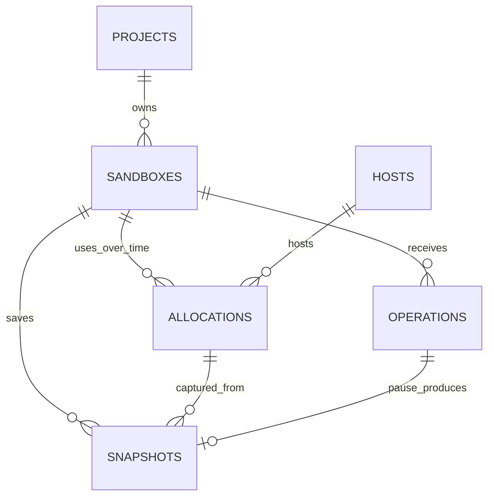

# Data models

Status: proposed initial PostgreSQL design. No migrations or runtime models are implemented yet.

Start with **six tables**. A project owns sandboxes; operations request actions; allocations reserve compute on hosts; snapshots preserve sandbox state. Hudson is a client of this service, and Temporal stays in the harness.

This is the selected model, replacing the earlier ten-table proposal. See [architecture and data flow](artitecture.md) for how these records connect to the running services, [implementation](implementation.md) for runtime details, and [identities and retries](identity-and-resources.md) for the API contract.

## Relationships



The diagram shows historical relationships. A sandbox can have many allocations over its lifetime, but at most one can remain unreleased. A pause operation produces at most one snapshot; a no-op pause produces none.

## The six models

IDs use PostgreSQL `uuid`, with a typed UUIDv7 prefix added in the API. All tables have `created_at` and `updated_at` timestamps. Times use `timestamptz`; counters use `bigint`; bounded structured metadata uses `jsonb`. The fields below describe the logical schema, not executable SQL.

### 1. projects — ownership and limits

API ID: `prj_<uuidv7>`.

| Fields | Purpose |
| --- | --- |
| `id`, `name`, `status` | Stable owner identity and lifecycle |
| `limits` | CPU, memory, sandbox count, and pending-operation quotas |
| `external_reference` (optional) | Mapping to a caller's organization or workspace |

Authenticated callers are authorized for a project. Knowing its ID is not permission. Authentication configuration maps callers to projects; credential and membership management are outside these six resource tables. Project names may repeat and IDs are never reused.

### 2. sandboxes — the persistent environment

API ID: `sbx_<uuidv7>`.

| Fields | Purpose |
| --- | --- |
| `id`, `project_id`, `name`, `labels` | Identity and ownership |
| `image_digest`, `image_compatibility`, `resources` | Verified immutable starting image and requested compute limits |
| `desired_state`, `observed_state`, `observed_at`, `state_revision` | Intent, last confirmed state, observation freshness, and concurrent-update protection |
| `generation`, `current_allocation_id` (nullable) | Latest allocation generation and current compute reservation |
| `current_snapshot_id` (nullable) | Published pause snapshot used for ordinary resume |
| `active_transition_operation_id` (nullable) | Serializes create/pause/resume/destroy transitions |
| `expires_at`, `destroyed_at` (nullable) | Sandbox lifetime and permanent destruction tombstone |

The API derives its visible status from the observed state and pending transition. The sandbox keeps its ID across pause/resume. Destroy permanently prevents further execution or resume.

### 3. operations — actions, retries, and results

API ID: `op_<uuidv7>`.

| Fields | Purpose |
| --- | --- |
| `id`, `project_id`, `sandbox_id`, `kind` | One admitted create, execute, pause, resume, destroy, cancel, or file mutation |
| `idempotency_key`, `request_digest`, `digest_version` | Deduplicate the caller's mutation and reject changed payloads under the same key |
| `payload`, `input_refs`, `target_operation_id` (nullable) | Validated request, pinned image/snapshot inputs, and cancellation target |
| `status`, `phase`, `result`, `error`, `output_refs` | Progress, bounded results, and stored-output metadata |
| `attempt_count`, `attempt_receipts`, `receipt_history_ref` (nullable) | Dispatch, acknowledgement, reconnect, and completion evidence, including allocation and claim revision |
| `claim_revision`, `lease_expires_at`, `next_retry_at`, `deadline` | Controller ownership and bounded scheduling/retries |
| `response_expires_at`, `completed_at` (nullable) | Result retention and completion time |

Use `UNIQUE (project_id, idempotency_key)` directly on this table. Admission inserts the operation and related resource changes in one transaction. A repeated key with identical content returns the same operation; a changed request returns a conflict.

Bound retries and receipt metadata. Preserve earlier allocation receipts when reconnecting after resume. If history exceeds the inline bound, publish an immutable history object and persist its reference before removing inline entries; do not discard unresolved execution evidence. No separate attempt table is required initially.

After result expiry, retain a compact operation tombstone containing its identity, ownership, retry key, request digest/version, and outcome for the project's lifetime. An expired identical retry returns `410` with the original operation identity and never reruns the command. Large payloads and outputs may expire independently. Active or unknown operations keep the evidence needed for reconciliation.

### 4. hosts — Linux compute machines

Internal ID: `hst_<uuidv7>`.

| Fields | Purpose |
| --- | --- |
| `id`, `status`, `last_seen_at` | Registered machine identity, readiness/draining, and health observation |
| `cpu_capacity`, `memory_capacity_mib`, `compatibility` | Schedulable resources and supported VM/image configuration |
| `supervisor_epoch` | Increasing registration epoch that rejects stale supervisor messages |

Hosts are infrastructure records shared across projects. Calculate reservations from unreleased allocations under transactional capacity checks. A heartbeat timeout makes a host uncertain; it does not prove its VMs stopped.

### 5. allocations — compute reservations

Internal ID: `alc_<uuidv7>`.

| Fields | Purpose |
| --- | --- |
| `id`, `project_id`, `sandbox_id`, `host_id` | Places one sandbox incarnation on one host |
| `generation`, `supervisor_epoch` | Rejects commands from old VM incarnations or supervisors |
| `vcpu`, `memory_mib`, `status`, `lease_expires_at` | Reserved resources and ownership lifetime |
| `release_evidence`, `released_at` (nullable) | Confirmed termination/fencing and release of the reservation |

Pause releases the allocation only after durable snapshot publication and confirmed VM shutdown. Resume creates a new allocation ID and increasing generation. A failed allocation consumes its generation; it cannot be reused.

### 6. snapshots — saved sandbox state

API ID: `snp_<uuidv7>`.

| Fields | Purpose |
| --- | --- |
| `id`, `project_id`, `sandbox_id` | Saved-state identity and ownership |
| `source_allocation_id`, `pause_operation_id` | Which VM and pause request produced the state |
| `status`, `upload_attempt_number` | Preparation, publication, and cleanup progress |
| `manifest_key`, `manifest_version`, `manifest_digest`, `compatibility` | Verified immutable references to matching memory, disk, and VM-state objects |
| `published_at`, `expires_at`, `deleted_at` (nullable) | Publication and retention lifecycle |

PostgreSQL stores metadata; object storage holds the large files. One pause operation reserves one snapshot ID across retries. A published manifest is immutable, and an incomplete upload cannot become resumable state.

## What we keep inside these models

| Deferred table | Initial representation |
| --- | --- |
| `request_keys` | Retry key and digest fields on `operations` |
| `operation_attempts` | Bounded attempt receipts and history references on `operations` |
| `image_versions` | Verified image digest and compatibility pinned on the sandbox/create operation; an operator-configured image allowlist controls permitted inputs |
| `artifacts` | Output references on `operations`, containing object key/version, digest, size, retention, and cleanup state |

There are no public image or artifact IDs initially. Retrieve outputs through their authorized operation. Output names identify entries within that operation, not arbitrary bucket paths. Separate catalogs or artifact management can be introduced when needed.

## Database rules

- Tenant-owned references carry `project_id`. Composite foreign keys must also ensure sandbox-local links point to the same sandbox: current allocation/snapshot, active transition, cancellation target, and snapshot source/pause operation.
- Enforce `UNIQUE (sandbox_id, generation)` and a partial unique constraint on `allocations(sandbox_id)` where `released_at IS NULL`.
- Enforce `UNIQUE (pause_operation_id)` on snapshots. Verify the referenced operation is a pause for the same sandbox before publication.
- Serialize lifecycle transitions with row locks/state revisions. An execute operation can stay suspended while a separate pause/resume operation runs.
- Publish the verified snapshot manifest and current snapshot pointer transactionally. Mark the sandbox paused only after allocation release is confirmed.
- A generation or expired database lease alone does not stop a VM. Require confirmed shutdown, infrastructure fencing, or the validated host lease watchdog before replacement execution.
- Perform reservation and project/host quota checks transactionally. Unknown allocations continue consuming their reservations until safely released.
- Expiring outputs must not remove retry protection or unresolved receipts. Project deletion revokes access, drains resources, and completes cleanup before purging records; it never permits ID reuse.

## Example session

```text
Project: Hudson development
└── Sandbox S: spreadsheet analysis
    ├── Create operation → allocation A on host 1
    ├── Execute operation E → runs a script
    ├── Pause operation P → publishes snapshot Q, releases A
    └── Resume operation R → restores Q into allocation B
                             continues E under its original deadline
```

Sandbox S stays the same. Allocation B gets a new ID and generation. An HTTP retry reuses its original operation, and resume never submits the frozen script as a new execution.
