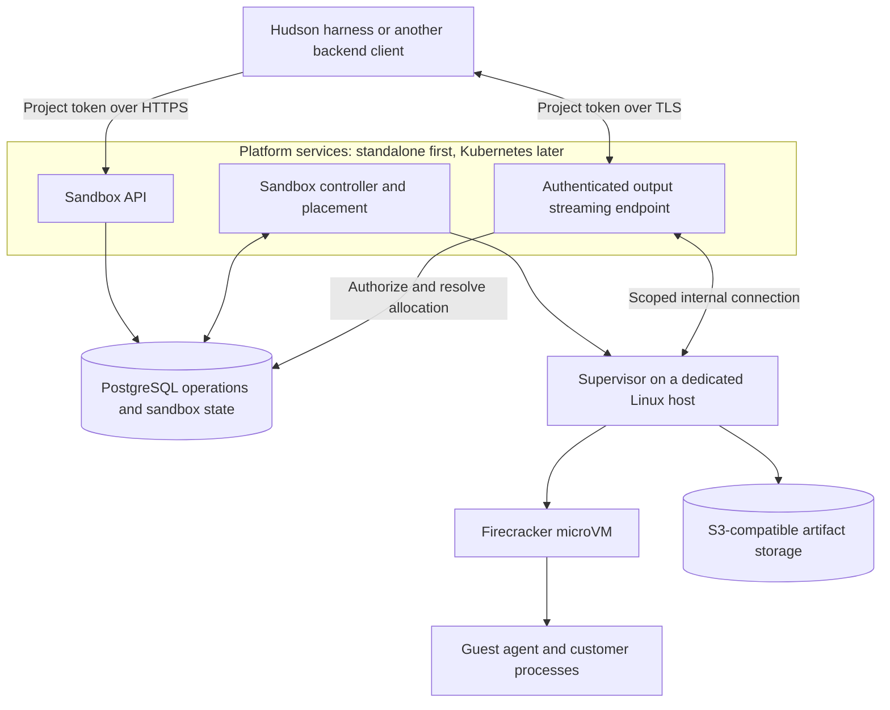

# Hudson Sandbox implementation design

Updated: 2026-09-19

Status: design only. The stack and ownership boundaries below are the selected direction. Detailed schemas, protocols, versions, and deployment configuration remain to be validated. No runtime or security guarantee has been implemented or tested yet.

## 1. Purpose and ownership

**Hudson is the agent harness. Hudson Sandbox is a tool it calls.**

Hudson Sandbox provides APIs to create, execute, pause, resume, and destroy isolated Linux sandboxes. It also handles files, execution limits, operation status, and resource cleanup. Clients do not need to use Hudson or Temporal to call these APIs.

| Component | Responsibility |
| --- | --- |
| Hudson harness, in the `hudson` repository | Agent behavior, business permissions, approvals, budgets, credentials, and any durable tasks implemented with Temporal |
| Hudson Sandbox, in this repository | Authenticated sandbox APIs, operation records, placement, lifecycle controllers, snapshots, execution limits, and cleanup |
| Kubernetes | Deployment and scheduling of platform services; resource controls for the workloads it manages |
| Firecracker and the host supervisor | Individual microVMs, their host resources, and isolated execution |

**This repository has no Temporal dependency.** It does not implement agent workflows, business approval logic, or a second durable workflow engine. PostgreSQL-backed operations and focused reconciliation loops provide the sandbox lifecycle's asynchronous control.

Hudson may wrap sandbox API calls in Temporal Activities in its own repository. Those calls use the same operation IDs, status APIs, and cancellation contracts as any other client. A sandbox does not receive Temporal credentials or understand workflow history.

The parent context is Hudson's [product goals](https://github.com/hudson-infinity/hudson/blob/main/docs/goals.md) and [Rust decision](https://github.com/hudson-infinity/hudson/blob/main/docs/implementation-decisions/0001-rust.md). This document updates the sandbox design only; it does not modify the harness repository.

## 2. Selected technology stack

| Part | Choice | Use |
| --- | --- | --- |
| Implementation | Rust | API, controller, supervisor, guest agent, and shared protocol types |
| Public interface | HTTP/JSON with OpenAPI | Lifecycle, commands, files, status, and a separate authenticated output stream |
| Client authentication | Opaque project API tokens over HTTPS | Hashed token storage, expiry, rotation, revocation, and project ownership checks |
| Isolation | Firecracker with Linux KVM | One microVM per sandbox |
| Durable metadata | PostgreSQL | Ownership, desired state, placements, operations, receipts, and snapshot manifests |
| Artifact storage | S3-compatible object storage | Memory snapshots, disk snapshots, workspace exports, and output artifacts |
| Platform deployment | Standalone first; Kubernetes later | Sandbox API, streaming endpoint, and controllers |
| Compute hosts | Dedicated Linux nodes with KVM | Firecracker execution through the host supervisor |
| Observability | OpenTelemetry, Prometheus, Grafana | Instrumentation, metrics collection, and operational views |
| Harness coordination | Temporal, only in `hudson` | Durable agent tasks outside this service |

Pin the Rust toolchain, dependencies, Firecracker release, guest kernel, and images after the first host integration is validated. Exact HTTP libraries, internal transport, telemetry backends for logs/traces, and version pins remain implementation decisions. Selecting OpenTelemetry does not by itself select a log or trace storage system.

PostgreSQL and object storage cover the initial persistence needs. Defer Redis, ClickHouse, elaborate scheduling, VM warm pools, and a dashboard until measurements or product requirements justify them. Customer programs may use any language installed in their guest image.

Firecracker's host API supplies VM controls; the supervisor uses that interface rather than embedding a hypervisor. See [Firecracker's design](https://github.com/firecracker-microvm/firecracker/blob/main/docs/design.md).

## 3. Kubernetes and compute boundary

Use the deployment pattern documented by [E2B](https://github.com/e2b-dev/runtime/blob/main/docs/ARCHITECTURE.md#deployment-topology): Kubernetes hosts platform services, while an orchestrator on each compute host manages individual Firecracker VMs. E2B is an architectural reference, not a dependency.

**An individual sandbox is not a Kubernetes pod in the initial design.** Kubernetes scheduling the API or supervisor does not automatically schedule or account for the VMs that supervisor creates. Our placement component reserves sandbox CPU, memory, and disk capacity; the host supervisor enforces those limits.

Start with standalone API/controller processes and one compute host, making placement a capacity check and reservation. Kubernetes deployment follows the verified single-host lifecycle. Add multiple eligible hosts later. Keep sandbox compute capacity dedicated, or explicitly reserve it from other Kubernetes workloads, so two schedulers cannot allocate the same resources independently. Account for host overhead and bounded image caches; exclude draining or unhealthy hosts. Reserve local writable/restore disk alongside CPU/RAM, and reserve snapshot staging space and upload slots before freezing a VM. Expired leases alone cannot free disk bytes or stop an uploader.

Kubernetes may deploy a privileged launcher for the host supervisor, but its exact packaging must be validated separately. The supervisor's host privileges never extend to customer processes. Node eviction, draining, or termination must coordinate with active sandboxes; replacing a service pod is not evidence that guest memory was saved.

Node-pool provisioning and autoscaling require a provider integration and sandbox-capacity signals; they are not supplied merely by deploying the API on Kubernetes. Initially provision the single host explicitly. A future one-pod-per-sandbox integration can be evaluated without changing the public API, but is not required for the first version.

## 4. Component flow



The API admits requests and persists operations. The controller claims pending work, checks capacity, calls the owning supervisor, and reconciles results. The supervisor manages Firecracker, jailer invocation, host networking, storage, execution deadlines, and VM leases.

The guest agent receives commands through a host-mediated channel, initially proposed as vsock. It manages process trees, reports status, streams bounded output, and transfers workspace files. Treat all guest messages as untrusted; fabricated identifiers, paths, or results cannot grant host authority.

The streaming endpoint initially shares the API service and forwards live output directly from the supervisor, with bounded buffers and sequence cursors. Output bytes do not pass through the controller or become database queue entries. Commands and cancellation still go through durable API admission. Authenticate every stream connection, check revocation/project state at most every 30 seconds, close at expiry or failed checks, and report replay gaps explicitly. Pause closes streams; resume reconnects under the same execute operation and a new allocation.

The controller and API may initially share a binary, but privileged host setup remains a distinct boundary. These are logical components rather than a requirement for one deployed service per module.

## 5. State and asynchronous operations

The [data model](data-models.md) starts with six tables: projects, sandboxes, operations, hosts, allocations, and snapshots. Retry keys, execution receipts, and output references live on operations. Images use immutable digests without a separate catalog table.

| State | Authority |
| --- | --- |
| Business decisions, approvals, agent progress | External harness; absent from the sandbox database |
| Sandbox ownership, desired state, operation status, placement generation | PostgreSQL |
| Actual VM and process observations | Host supervisor, reconciled into durable metadata with observation timestamps |
| Snapshot manifest and publication status | PostgreSQL, referencing a complete immutable artifact set |
| Memory, disk, files, and output bytes | Object storage, with local copies used for active execution or caching |

Admit a request by transactionally inserting its operation and updating the relevant desired state. The operation table is also the initial pending-work queue; an in-memory notification may accelerate discovery but cannot be the only delivery mechanism.

Controllers claim work with bounded leases, monotonically increasing claim revisions, and conditional database updates. Multiple replicas must not own the same transition concurrently. On controller restart or lease expiry, a new owner first reconciles receipts and host observations, then continues only if safe. Metadata writes and supervisor requests validate the current claim revision as well as the allocation generation, rejecting an old controller even when the VM allocation has not changed.

Persist bounded attempt counts, deadlines, next retry times, and terminal errors. Distinguish queued, running, succeeded, failed, cancelled, and unknown outcomes. A lost network response does not establish failure. Requests return a durable operation handle; clients inspect status or reconnect to progress streams without keeping the original HTTP request alive.

Do not store credentials or large streams in operation records. Store artifact references, digests, bounded metadata, and redacted diagnostics. Apply access control, encryption, retention, and deletion policies to both records and artifact contents.

## 6. API contract

Use `Authorization: Bearer <project-api-token>` over HTTPS for backend clients. Validate the opaque token against its project token hash and expiry/revocation metadata, then authorize the requested resource. The same token authenticates backend output streams. Tokens stay out of URLs, logs, operation payloads, and guests. See [architecture auth](artitecture.md#simple-project-token-authentication) and [project token storage](data-models.md#1-projects--ownership-and-limits).

Requests are scoped to an authenticated project and sandbox. The [identity and resource design](identity-and-resources.md) defines prefixed UUIDv7 IDs, PostgreSQL relationships, retry semantics, and storage keys. The sandbox ID survives pause/resume; each new VM allocation receives a separate identity and increasing generation.

The service generates operation IDs. Clients supply an `Idempotency-Key` on mutating requests so a lost first response can be retried without knowing the operation ID. A matching key and request digest in the authenticated project returns the existing operation; a changed request is a conflict. Controller attempts use `(operation_id, attempt_number)` and keep the same logical operation ID. Compact deduplication records survive result expiry and destruction, so an expired response cannot silently turn into new execution.

An external correlation ID, such as a Hudson run ID, is optional metadata; it is never required for execution or used as proof of ownership. Authentication, not an ID prefix or guessed object key, determines access.

| Operation | Contract |
| --- | --- |
| Create | Accept an authorized immutable image digest and limits; pin verified template compatibility at admission; identical retries return the original operation |
| Execute | Accept executable, argument array, working directory, nonsecret environment, deadline, and output bounds; return an operation handle |
| Pause | Save guest memory and matching disk state, publish the snapshot, release compute, and report completion only after those stages are confirmed |
| Resume | Restore a completed snapshot into one authorized allocation and report ready after guest communication is reestablished |
| Destroy | Revoke sandbox access, stop execution, and reclaim resources; repeated requests are safe |
| Inspect sandbox/operation | Return desired state, observed state, generation, progress, freshness, and known result references |
| Cancel operation | Request interruption; report confirmed cancellation only after actual stopping or a safe transition boundary |
| Import/export files | Validate ownership, paths, sizes, and digests; use staging or bounded streams |

Serialize conflicting lifecycle transitions and workspace-mutating commands initially. Reject execution while pausing, paused, resuming, or destroying. Commands active during pause are frozen with the VM; they are resumed from the snapshot, not submitted again. If the guest's process records cannot be restored consistently, pause must fail explicitly rather than claim resumability.

Sandbox lifecycle states include creating, running, pausing, paused, resuming, destroying, destroyed, and error/unknown. Persist the last confirmed state and incomplete transition separately. Retry handling must not infer that a VM is paused, running, or destroyed from desired state alone.

Explicit shell execution is allowed only inside the guest. The host never interpolates customer input into privileged shell commands. Process results distinguish exit code, signal, timeout, cancellation, infrastructure failure, and unknown outcome; a zero exit code does not establish business success.

## 7. Create and execute flow

1. The client chooses an action. Hudson, when it is the client, checks its own business permissions and approvals before making the API request.
2. The sandbox API authenticates the client, enforces sandbox ownership and resource quotas, and persists an operation.
3. The controller claims the operation and selects the existing host or reserves capacity for a new sandbox. Initially there is one eligible host.
4. The supervisor validates the generation, template, and limits; prepares networking and storage; and starts Firecracker through the jailer.
5. After guest readiness, the supervisor dispatches commands using their stable operation IDs. It records dispatch and acknowledgement separately.
6. Bounded output and result artifacts are persisted. The controller records the confirmed outcome and the client retrieves it by operation ID.
7. Explicit destruction or the configured expiry policy triggers cleanup independently of whether the client is still connected.

The sandbox service continues admitted work if Hudson or its Temporal workers disconnect. A disconnected client does not extend sandbox lifetime. Clients poll an existing operation handle or retry the original mutation with the same idempotency key, including when the first response was lost.

## 8. Pause, release compute, and resume

**Pause/resume is a core capability, not a later optional feature.** The first complete milestone must prove memory and disk preservation. Raw Firecracker pause only freezes a VM; our API's pause operation additionally saves its state and releases compute.

Pause proceeds through explicit stages:

1. Acquire the lifecycle transition and prevent new commands. Reserve staging bytes and a host upload slot before freezing; keep the VM runnable while waiting. Freeze customer process groups separately from the guest agent, then quiesce the filesystem as required by the snapshot procedure.
2. Freeze execution and capture a consistent memory, VM-state, and disk artifact set. The initial implementation can use full snapshots; differential and lazy loading optimizations come later.
3. Upload and verify the artifacts, then atomically publish the immutable snapshot manifest. Local files alone are not a durable completed snapshot.
4. Stop the VM and reclaim its compute/network and allocation disk resources. Mark the sandbox paused only after snapshot publication and allocation release are confirmed. Track staging bytes on the snapshot until their file cleanup is confirmed; release upload slots only after the uploader has completed or stopped.

A failed upload leaves the pause operation incomplete; do not destroy the only viable state and report success. Track whether the old VM is frozen, runnable, or lost so recovery can retry, safely roll back, or report an unknown outcome. Cleanup after a published snapshot is retryable without repeating the snapshot unnecessarily.

Resume reserves CPU/RAM/disk on a compatible host, validates the manifest, and loads the disk and memory with the VM paused and egress blocked. The snapshot contains frozen customer process groups and a separate guest agent. Resume the VM so only management can reconnect; authenticate the new session, refresh management credentials, reconcile time and absolute deadlines/cancellation, and apply current policy before releasing eligible customer processes. Persist the handshake and release acknowledgements. If this process gate cannot be established, stop/fence the partial restore and report failure or uncertainty. The previous allocation must be stopped or fenced before the restored one runs. Restoring a snapshot is not permission to clone a workload into multiple active copies.

Persist sandbox and command wall-clock deadlines outside the snapshot. Pausing does not automatically extend them; expired commands must be terminated before restored customer execution is released. Separate paused-snapshot retention from active-compute and idle limits, with explicit defaults chosen during implementation.

Publish a tested compatibility matrix for CPU architecture/model, guest kernel, agent, and Firecracker versions. Reconnect protocols and refresh guest capabilities after restore. Old network connections and credentials cannot be assumed valid. See [Firecracker snapshot support](https://github.com/firecracker-microvm/firecracker/blob/main/docs/snapshotting/snapshot-support.md).

A controller or host crash does not automatically preserve work since the last published snapshot. Restoring an older snapshot can repeat external effects; return that uncertainty and require an explicit recovery decision when replay would be unsafe. Ordinary resume uses the completed pause snapshot. It must not silently fall back to a filesystem-only restart and claim memory continuation.

Destroy prevents future resume and removes active allocations. Its receipt states which artifacts were deleted or retained under policy; retention and byte-level garbage collection are tracked separately from compute release.

## 9. Controllers, limits, and recovery

The [architecture recovery table](artitecture.md#destroy-and-recovery) defines persisted evidence and safe continuation at each create/execute/pause/resume/destroy boundary. Record intent before dispatch and receipts afterward; interrupt these boundaries in failure-injection tests.

The service needs focused loops for pending operations, host health/capacity, expired allocations, snapshot progress, and orphan cleanup. It does not need a general workflow framework. PostgreSQL is their durable source of intent; the host supervisor supplies observations and enforces local deadlines.

| Failure | Required handling |
| --- | --- |
| API reply lost after admission | Return the existing operation on an identical retry |
| Controller dies after host dispatch | Reconcile the same operation and allocation; do not blindly start another process |
| Command finishes but receipt is lost | Inspect surviving state; return unknown if completion cannot be established |
| Host unreachable | Preserve uncertainty and fence the old allocation before any replacement execution |
| Pause upload fails | Keep the operation incomplete and recover from the last confirmed stage |
| Resume fails before readiness | Reconcile or tear down the partial allocation; preserve the published snapshot |
| Client cancels during snapshot publication | Resolve the publication/cleanup boundary before reporting cancellation; never expose a partial snapshot as ready |
| Access revoked | Reject new operations and apply current sandbox policy; the external harness handles business-level revocation |
| Cleanup partially fails | Record remaining resources and let the reconciler retry |

Allocation generations and expiring leases prevent stale commands and identify current owners. A partitioned host must stop its VMs when its local lease watchdog expires. A generation change in PostgreSQL alone does not stop execution on a disconnected machine. Replacement requires confirmed termination, infrastructure fencing, or a validated lease-expiry mechanism.

Enforce CPU, RAM, disk, output, execution-time, and concurrency limits outside guest control. Keep a bounded number of pending operations per project and reject or queue capacity shortages explicitly. Expiry policy may pause or destroy a sandbox, but failure to save state must be visible; any hard-limit forced termination must be reported as such.

Automatic retries are appropriate only when receipts and operation semantics make them safe. Arbitrary commands can have external side effects, so this service does not promise exactly-once execution. A caller timeout is not cancellation, and a requested cancellation is not proof that execution stopped.

## 10. Security and harness integration

The sandbox authenticates project tokens, authorizes access to sandbox resources, and enforces execution policy. User login and memberships stay in the harness. Operator tooling provisions and rotates random project tokens, with at most two active keys per project for overlap; the service stores only hashes and lifecycle metadata. Internal supervisor connections use separate operator-managed service credentials over authenticated TLS, scoped to their intended service/host. Customer tokens cannot authorize host administration. Browser-specific stream credentials remain deferred. The harness decides business permissions, approval rules, and which tools its agent may invoke. Neither role is delegated to model output. Token revocation prevents new requests and new execution dispatch under that key, while required reconciliation/stop/cleanup continues under service authority. Revocation alone is not cancellation of an already-running command; use explicit cancellation or destruction to stop it.

Use Firecracker jailer, supported seccomp filters, per-VM cgroups/namespaces, restricted host sockets, immutable verified templates, and a private writable filesystem per sandbox. Harden host setup using [Firecracker's production guidance](https://github.com/firecracker-microvm/firecracker/blob/main/docs/prod-host-setup.md).

Enforce deny-by-default egress through host-controlled networking and filtering. Block cloud metadata, platform databases, supervisor control channels, and other tenants. Approved destinations must not permit bypasses through DNS changes, IPv6, redirects, or alternate protocols. Validate this with adversarial network tests.

Keep privileged file operations symlink-safe and reject archive/path traversal. Bound message sizes, process output, and uploads. Guest root must not imply access to host paths, devices, orchestration credentials, or another sandbox.

Snapshots contain customer memory and may contain sensitive data. Encrypt and restrict them to their owner, verify integrity, and enforce retention/deletion. Keep tenant data out of reusable base templates. Revalidate current sandbox access on resume rather than trusting credentials restored from memory.

For Hudson integration, business credentials remain in the harness's trusted connector infrastructure. Customer code may call an externally configured, scoped tool gateway if network policy permits it. That gateway belongs to Hudson and performs business checks; it is not required to operate this standalone sandbox service. Temporal remains outside the sandbox tool's dependencies and trust boundary.

## 11. Suggested Rust workspace

```text
crates/
  sandbox-protocol/     # Request, event, receipt, and error types
  sandbox-api/          # Authentication, admission, status, and OpenAPI
  sandbox-controller/   # Operation claims, placement, lifecycle reconciliation
  sandbox-supervisor/   # Host resources, jailer, Firecracker, snapshots, leases
  sandbox-guest/        # Commands, files, and bounded guest reporting
  sandbox-store/        # PostgreSQL transactions and object-storage interface
  sandbox-cli/          # Development and operator client
images/                 # Guest image and kernel build definitions
deploy/                 # Kubernetes services and dedicated Linux host setup
tests/                  # Integration, recovery, isolation, and protocol tests
```

There are no sandbox Temporal workers, workflow crates, or Temporal service manifests. Introduce crate boundaries only where dependency, testing, or privilege separation benefits justify them.

## 12. Development and operations

Begin with one Linux compute host exposing KVM and one supported architecture. A standalone development setup needs the API/controller, PostgreSQL, object storage, and that host. It must run without the Hudson harness or a Temporal service. Kubernetes is the intended platform deployment, not a requirement for every developer unit test.

Use a remote Linux host for real VM tests from macOS. An unrestricted local process is not a substitute for the isolation boundary. Publish reproducible guest image builds with immutable digests and compatibility metadata.

Instrument operations through OpenTelemetry and expose metrics for Prometheus/Grafana. Record queue time, VM readiness, snapshot/upload duration, restore duration, resource usage, lease expiry, uncertain outcomes, and leaked resources. Correlate by project, sandbox, operation, attempt, host, and optional caller correlation ID. Redact secrets and keep terminal output in bounded artifacts.

Drain hosts before maintenance and prevent new placements while draining. Verify resumable snapshots before removing hosts that hold running workloads; preserve explicit failure outcomes for forced termination. Database migrations, API/controller upgrades, host supervisor upgrades, and guest image changes need independent compatibility and rollback plans. Kubernetes restarts do not replace those plans.

## 13. Validation and delivery

The first end-to-end demonstration is **create → execute → snapshot → release compute → restore → destroy** using only the sandbox API.

Before calling the first version usable, demonstrate:

1. A Python or JavaScript client creates a sandbox, runs code, and retrieves an artifact without Hudson or Temporal running.
2. A process with changing memory and files survives a completed pause and resumes from the saved state after compute is released.
3. Partial uploads and interrupted pause/resume transitions never produce a false ready snapshot or duplicate live allocation.
4. Repeated requests reuse known operations; conflicting payloads under the same ID are rejected.
5. Controller restart during a command recovers its receipt or exposes an unknown outcome without unsafe retries.
6. Cross-tenant and control-plane access are blocked, including from a privileged guest process.
7. Resource limits, absolute deadlines across pause/resume, cancellation, and lease expiry have verified effects.
8. Revoked sandbox access stays revoked after restore, and snapshots/artifacts enforce owner checks.
9. Destroy releases resources, prevents later resume, and reports retained or pending-deletion artifacts accurately.
10. Restarted supervisors and reconcilers reclaim orphans without destroying live authorized allocations.
11. Project-token expiry/revocation blocks requests and closes streams within the 30-second recheck bound; rotation works and tokens never reach guest snapshots or logs.
12. Concurrent creates and pauses cannot over-reserve disk or upload slots; partial failures retain reservations until cleanup is confirmed.
13. Customer processes remain frozen throughout restore management and deadline/policy refresh; a lost release acknowledgement never causes another VM to run.
14. Stream reconnects preserve operation identity and use explicit cursors/gaps without rerunning commands.

| Phase | Exit condition |
| --- | --- |
| 1: Single-host execution | Standalone Rust API/controller, six-table PostgreSQL model, project tokens, and supervisor with one jailed VM, command output streaming, limits, files, and teardown |
| 2: Core pause/resume | Complete memory/disk snapshot, durable publication, compute release, and validated restore on the supported host configuration |
| 3: Recovery and isolation | PostgreSQL-backed controllers, request deduplication, restart/failure tests, fencing, and the validation cases above |
| 4: Deployment and integration | Kubernetes service manifests, dedicated host deployment, monitoring, and Hudson calling the ordinary APIs from its own tasks |
| 5: Multiple hosts and optimization | Capacity-aware placement, cross-host compatible restore, draining, provider autoscaling, and measured caching/snapshot optimizations |

Open details are exact versions, database schema, object-store vendor, API paths, guest/host transport, supported host configuration, lease/fencing mechanism, and resource/retention defaults. No latency, density, or availability claim is made until measured on explicit workloads.

Live migration, transparent recovery of unsaved memory after host loss, one Kubernetes pod per sandbox, and a custom hypervisor are outside the initial scope. Redis, ClickHouse, a dashboard, and more elaborate scheduling remain deferred.
