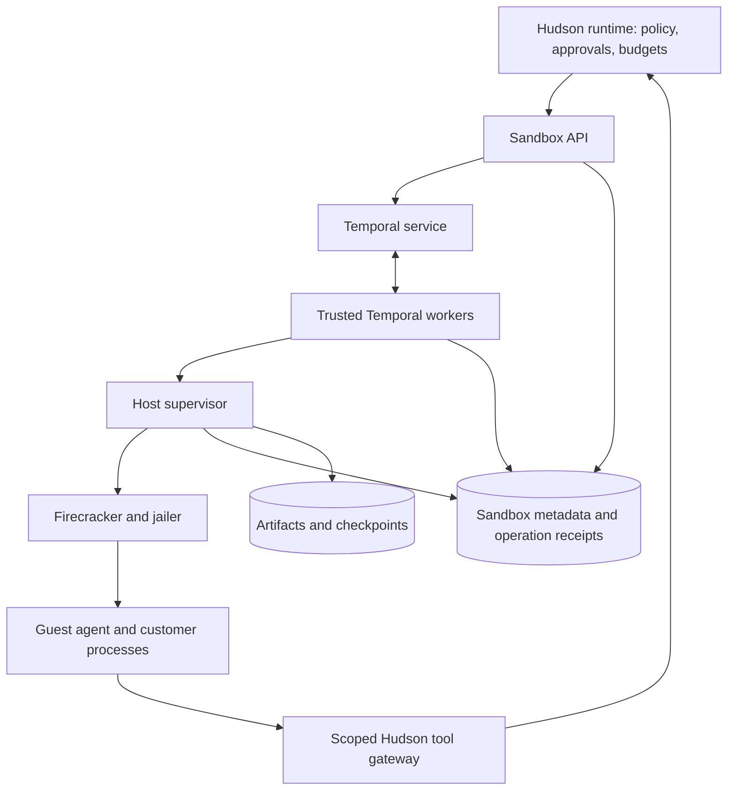

# Hudson Sandbox implementation design

Date: 2026-09-19

Status: initial design. Rust, Temporal, and Firecracker are the selected direction for this repository. Component layouts, contracts, storage choices, and delivery phases below are proposed implementation details, subject to validation. Nothing described here is shipped behavior.

## 1. Purpose and scope

Hudson Sandbox is the execution backend for customer code hosted by Hudson. It will run generated scripts, customer functions, and custom harness processes inside isolated Linux environments while Hudson retains authority over permitted actions.

The implementation uses three layers:

| Layer | Responsibility |
| --- | --- |
| Hudson main runtime | Agent definitions, harness behavior, run state, business permissions, approvals, credential authority, budgets, and evaluation orchestration |
| Temporal and trusted sandbox workers | Durable coordination of sandbox operations, timers, retries, reconciliation, and cleanup |
| Firecracker and a guest agent | An isolated Linux VM with command execution, files, and bounded resource use |

This project builds a service around existing virtualization and durable execution technology. It does not implement a hypervisor or fork Firecracker. E2B is an architectural reference, not a required dependency in this design. Anthropic's sandbox runtime is not the selected isolation boundary for hosted customer workloads.

Hudson's [product goals](https://github.com/hudson-infinity/hudson/blob/main/docs/goals.md) and [Rust decision](https://github.com/hudson-infinity/hudson/blob/main/docs/implementation-decisions/0001-rust.md) remain the parent product context. This document does not modify the main repository's decisions or expand its first milestone automatically.

## 2. Implementation language and dependency policy

Use Rust for the sandbox API, Temporal workers, host supervisor, guest agent, and shared protocol types. Customer programs may use any language available in their selected guest image. The external API remains language-neutral.

Use the official Temporal Rust SDK. Prove the necessary workflow, Activity, cancellation, heartbeat, replay, and worker upgrade behavior in a small integration before committing to a crate layout. Pin the Rust toolchain, dependencies, Firecracker release, guest kernel, and base image once that integration is validated; this design deliberately does not invent version pins.

Temporal publishes a [Rust development guide](https://docs.temporal.io/develop/rust). Firecracker exposes a host API for configuring and managing microVMs; the supervisor should use that interface rather than link virtualization internals into Hudson. See the [Firecracker design](https://github.com/firecracker-microvm/firecracker/blob/main/docs/design.md).

## 3. Component placement



Temporal's service, its persistence, and trusted workers run outside customer microVMs. Guests receive neither Temporal credentials nor access to task queues. Workflow recovery must remain available when a host or VM fails.

The host supervisor is the only component allowed to perform privileged VM setup. It manages host networking, resource controls, jailer invocation, VM API sockets, and local storage. Its interface accepts validated sandbox specifications rather than arbitrary host commands or paths.

The guest agent starts commands, reports process status, streams bounded output, and exchanges authorized workspace files. It is reachable through a host-mediated vsock channel. Treat guest responses as untrusted: a compromised guest must not acquire host authority by fabricating results, identifiers, paths, or protocol messages.

A single-host deployment may colocate trusted services, but customer execution must still cross the VM boundary. These are logical components, not a requirement to deploy one service for every module.

## 4. Ownership of state

| State | Authority |
| --- | --- |
| Agent run, business approval, current access policy | Hudson main runtime |
| Sandbox lifecycle orchestration | Temporal workflow history |
| Sandbox identity, placement generation, desired state, operation receipts | Sandbox metadata store |
| Local VM/process observations | Host supervisor; observations are reconciled with durable records |
| Workspace exports, output artifacts, future snapshots | Artifact storage, referenced by immutable identifiers and digests |

Propose PostgreSQL for sandbox metadata and an object-store interface for artifacts. Temporal owns its own persistence schema. Sandbox code must not read or mutate Temporal's internal tables; application metadata remains separate even if a development installation shares a database server.

Temporal history contains bounded metadata and artifact references. Do not put credentials, full terminal streams, large files, or VM snapshots in workflow payloads. Sensitive artifact contents need access controls, encryption, retention, and deletion policies.

API admission should transactionally persist an operation and a dispatch-outbox entry. A dispatcher starts or signals a workflow using stable identifiers and retries delivery until acknowledged. This bridges the metadata/Temporal boundary without assuming a distributed transaction. Workflow status projections must be reconstructible and must expose observation timestamps.

## 5. Identities and execution contracts

Every operation carries workspace ID, Hudson run ID, sandbox ID, operation ID, request digest, deadline, and trace context. Placement adds host ID and a monotonically increasing generation. Authentication determines ownership; caller-supplied IDs never grant access by themselves.

A logical operation keeps its ID across transport and Temporal retries. Attempts have separate IDs. Reusing an operation ID with a different request digest is a conflict, not a new execution. Receipts must survive VM teardown and remain available for at least the supported retry/reconciliation window.

The first implementation should define these operations through versioned HTTP/JSON contracts and OpenAPI. Paths and Rust signatures remain to be finalized.

| Operation | Required behavior |
| --- | --- |
| Create sandbox | Admit an immutable template digest and limits; return the existing allocation for an identical retry |
| Inspect sandbox | Return desired state, observed state, generation, and freshness |
| Execute command | Accept executable, argument array, working directory, nonsecret environment, deadline, and output bounds; return a durable operation handle |
| Inspect command | Return queued/running/terminal/unknown state and result references |
| Cancel command | Request termination of the process tree; acknowledge completion only when stopping is confirmed |
| Import/export workspace files | Validate ownership, paths, size, and digest; transfer through staging or bounded streams |
| Destroy sandbox | Revoke access, stop execution, reclaim resources, and tolerate repeated requests |

Explicit shell execution may be supported as customer code inside the guest. The host must never build a shell command by interpolating customer input.

A command result distinguishes process exit, signal, timeout, cancellation, infrastructure failure, and unknown outcome. A zero exit code does not establish business success. Output includes artifact references and truncation flags so a dropped stream is never mistaken for complete evidence.

## 6. Temporal integration

Start with one sandbox-lifecycle workflow per sandbox. It coordinates allocation, command operations, lease/deadline timers, and destruction. It does not own the agent's planning loop or wait for business approvals on Hudson's behalf. The exact relationship with a future Hudson run workflow is an integration contract, not a second owner of run state.

Workflow code must remain deterministic. All host RPCs, database operations, artifact transfers, and other external I/O belong in Activities. If model calls are later coordinated by Hudson workflows, they also belong in Activities. Recorded Activity results are reused during workflow replay; retries of incomplete Activities are a separate concern. See [Temporal workflows](https://docs.temporal.io/workflows).

Use Activities to admit or inspect host operations, wait for bounded command progress, and reconcile or clean up resources. A retried execution Activity uses the existing operation ID and first inspects its receipt. It must not assume it should start a new process.

Long-running Activities heartbeat bounded progress and operation identifiers, with explicit heartbeat and overall timeouts. Activity heartbeats support retry/cancellation handling; they are not a guest process checkpoint or proof that the old attempt stopped. See [Temporal Activities](https://docs.temporal.io/activities).

Serialize workspace-mutating commands in the initial version. Enforce queue bounds, VM idle expiry, command deadlines, and a maximum sandbox lifetime. Use bounded histories and Continue-As-New only at defined boundaries with pending operations and ownership carried forward. Validate this behavior against the selected SDK before implementation.

Workflow cancellation invokes cleanup where possible, but forced termination, service outages, and worker loss may bypass that path. An independent supervisor lease watchdog and periodic reconciler must reclaim abandoned VMs.

## 7. Command execution flow

1. Hudson validates the requested action, arguments, workspace access, approval, and remaining budget. It issues narrowly scoped execution authority with an expiry and operation identity.
2. The sandbox API authenticates Hudson, validates that authority, checks quotas, and persists the operation plus dispatch record.
3. A Temporal worker requests allocation or locates an existing live sandbox. The initial scheduler targets a single host and reserves resources atomically.
4. The supervisor verifies template digest, ownership generation, and limits; prepares storage and networking; then starts Firecracker through the jailer.
5. After guest readiness, the supervisor sends the command to the guest agent. The host keeps a receipt before dispatch and records acknowledgements and observations afterward.
6. Output is bounded and uploaded to artifact storage. Guest-reported completion becomes an execution receipt, not an authorization decision.
7. The worker records the outcome in durable metadata and completes its Activity with references. Hudson receives an idempotent result notification or retrieves the operation status.
8. Idle expiry or explicit destruction revokes access and removes the VM, networking, and writable storage. Retained artifacts follow their separate retention policy.

If a receipt proves completion, retries reuse it. If the receipt only proves dispatch, recovery inspects the existing execution. No database write can atomically cover an arbitrary external side effect performed by guest code.

## 8. Failure and retry semantics

| Failure | Required handling |
| --- | --- |
| API response lost after admission | Retry with the same operation ID and return the admitted operation |
| Workflow dispatch acknowledgement lost | Outbox redelivery uses the same workflow and operation identities |
| Worker dies while a VM command runs | A replacement inspects the supervisor/receipt and reconnects; it does not blindly launch another command |
| Command finishes but result acknowledgement is lost | Reuse a durable terminal receipt; otherwise reconcile or return unknown |
| Host becomes unreachable | Mark execution uncertain; fence/revoke the old allocation before replacement execution |
| Host is permanently lost | Return known receipts; treat unrecorded effects as unknown; restore only persisted workspace data |
| Artifact upload fails | Retain bounded local data where possible and retry upload; do not claim artifacts are durable |
| Approval or permission expires | Reject new operations; revoke relevant live capability access and cancel affected work according to policy |
| Cancellation times out | Report cancellation requested/unknown and escalate to VM termination; do not report confirmed cancellation prematurely |
| Cleanup partially fails | Persist outstanding resources and retry through an independent reconciler |

Temporal retry policies should distinguish transient infrastructure failures from invalid requests, permission denials, quota exhaustion, and unknown external outcomes. Automatic retries are allowed only when the operation's semantics make them safe. Arbitrary customer commands are not assumed idempotent.

Use allocation generations and expiring leases to reject stale supervisor requests and tool-gateway access. A partitioned host must stop its VM when its local lease watchdog expires. Before launching a replacement, establish that the previous allocation cannot continue: positive termination, infrastructure fencing, or a validated lease-expiry mechanism. A metadata generation alone cannot stop CPU execution on an isolated host.

Fencing cannot undo an external action already completed. Financial writes, messages, and other business effects must pass through Hudson's authorized connectors with idempotency or reconciliation appropriate to the destination. This system makes no exactly-once promise for arbitrary external actions.

## 9. Security boundary

Treat customer code, packages, custom harnesses, and guest output as untrusted. Keep the sandbox API, Temporal, supervisor interfaces, databases, and credential infrastructure unreachable from guest networks.

The implementation must provide:

- Firecracker's jailer and supported seccomp configuration, per-VM cgroups and namespaces, restricted host API sockets, and least-privilege host services.
- Immutable, verified guest templates; a private writable filesystem per sandbox; explicit vCPU, RAM, disk, process, output, and wall-time limits.
- Deny-by-default egress enforced outside the guest. Approved destinations flow through host-controlled routing/proxies; block direct bypasses, cloud metadata endpoints, and control-plane networks. Account for DNS resolution changes, IPv6, redirects, and alternate protocols.
- Authenticated tenant-scoped APIs and host control channels. A sandbox cannot select another tenant's files, receipts, artifacts, or VM by supplying its identifiers.
- Archive/path traversal defenses and symlink-safe file handling. Host filesystem paths and privileged device handles are never customer-controlled.
- Bounded parsing, output backpressure, process-tree termination, orphan reclamation, and atomic resource reservation before dispatch.

Firecracker provides the virtualization boundary, but host setup and traffic filtering remain operator responsibilities. Follow its [production host guidance](https://github.com/firecracker-microvm/firecracker/blob/main/docs/prod-host-setup.md) and validate the configuration with isolation tests.

Business credentials stay in Hudson's trusted connector infrastructure. Guest code receives only a short-lived capability to request specific operations through a gateway. The gateway rechecks current policy, approval, arguments, and allocation generation on each request. Do not give guests broad provider keys or rely on domain allowlists to enforce business permissions.

Customer programs must be unable to access the orchestration database, Temporal service, host filesystem, or other guests even if they gain root inside their own VM. Guest-side resource limits improve behavior, but hard host limits remain necessary when the guest is compromised.

## 10. Durability, workspaces, and snapshots

Three forms of state remain distinct:

| State | Recovery behavior |
| --- | --- |
| Temporal workflow history | Recovers coordination decisions and recorded results |
| Workspace artifacts | Restore explicitly persisted files into a fresh environment |
| Firecracker snapshots | May later restore guest memory, machine state, and matching disk state |

The first release should boot a known image and persist explicit workspace exports. It does not promise recovery of arbitrary in-memory customer programs. Unexported data on a lost host may be lost; API results must identify the latest durable workspace checkpoint.

When a run waits for approval, Hudson persists its own run state. A sandbox may remain alive for a bounded idle period, but long waits release compute after any requested workspace export. Resuming creates an environment from persisted files and revalidates permissions; it does not require a VM to run for the duration of the wait.

Snapshot support is a later optimization. Before enabling it, define disk/memory consistency, artifact integrity, supported CPU/kernel/Firecracker combinations, retention, and restore validation. Reestablish guest communication and current capability authority before permitting work after restoration. Templates must contain no tenant secrets; tenant snapshots remain private to that workload.

Restored network connections and external credentials cannot be assumed valid. Never fork an active side-effecting workload into multiple runnable copies. Snapshot publication must reference a complete verified set of artifacts. See [Firecracker snapshot support and limitations](https://github.com/firecracker-microvm/firecracker/blob/main/docs/snapshotting/snapshot-support.md).

## 11. Suggested Rust workspace

```text
crates/
  sandbox-protocol/     # Versioned request, event, receipt, and error types
  sandbox-api/          # Authenticated admission, status, and dispatch outbox
  sandbox-workflows/    # Deterministic Temporal lifecycle definitions
  sandbox-worker/       # Activities, host clients, and reconciliation
  sandbox-supervisor/   # Host resources, jailer, Firecracker, and leases
  sandbox-guest/        # Commands, file transfer, and bounded guest reporting
  sandbox-store/        # Metadata transactions and artifact interfaces
  sandbox-cli/          # Development and operator client
images/                 # Guest image and kernel build definitions
deploy/                 # Local control plane and Linux host setup
tests/                  # Integration, recovery, isolation, and protocol tests
```

This is a starting layout. Introduce crates when compilation or trust boundaries justify them; avoid a service or abstraction for every future capability. Keep privileged host setup separate from general API request handling.

## 12. Development and deployment

Start with one Linux host exposing KVM and one supported CPU architecture. A local control-plane stack should provide Temporal, sandbox metadata, and artifact storage. Use a remote Linux host for real VM execution when developing on macOS; do not silently substitute an unrestricted local process and label it equivalent isolation.

A self-hosted installation should include the real single-host Firecracker path and the same API contracts. Local storage implementations may simplify development, with their durability limits documented. Managed-cloud deployment can later add multiple hosts, placement, draining, capacity management, and dedicated host pools.

Guest images are built separately from command execution. Publish immutable digests with kernel, agent, architecture, and Firecracker compatibility metadata. Patch both host and guest dependencies; promote tested versions gradually and drain incompatible hosts. Workflow upgrades require replay compatibility tests independently of VM image upgrades.

## 13. Observability and validation

Link each event to workspace, run, sandbox, operation, attempt, host, and generation. Record admission, allocation, command start/end, timeouts, policy denial, uncertain outcomes, artifact persistence, and cleanup. Keep public operational evidence separate from private model reasoning and redact secrets before persistence.

Measure queue delay, VM readiness, command runtime, artifact transfer, peak resources, expired leases, uncertain outcomes, and leaked allocations. A running worker, a responding guest, and a completed command are different signals. No latency, density, or availability target is claimed until measured on a named workload and host configuration.

Before declaring the first version usable, demonstrate:

1. A Python or JavaScript client creates a VM, executes code, retrieves an artifact, and destroys the environment through the API.
2. Repeated create/execute requests with the same IDs do not duplicate known work; conflicting payloads are rejected.
3. Worker restart during execution recovers the same operation and a completed receipt is reused.
4. Injected host loss and lost acknowledgements produce explicit unknown outcomes rather than unsafe retries.
5. Cross-tenant reads, writes, network access, metadata access, and control-plane access are blocked, including from a privileged guest process.
6. CPU/memory/disk/output limits, deadlines, process-tree cancellation, lease expiry, and cleanup have observable outcomes.
7. Hudson revocation prevents later privileged tool calls and restoration does not reinstate old authority.
8. Temporal history replay survives a compatible worker upgrade; output streams and secrets do not enter workflow history.
9. Workspace exports survive VM teardown, while incomplete exports are reported honestly.
10. Restarting supervisors and reconcilers reclaims orphaned resources without destroying live authorized allocations.

## 14. Delivery phases and unresolved choices

| Phase | Deliverable and exit condition |
| --- | --- |
| 1: SDK and host proof | Pinned Rust/Temporal integration and one jailed Firecracker VM on a supported Linux host; command, deadline, and teardown demonstrated |
| 2: Durable execution | API admission, outbox, operation receipts, artifact transfer, worker recovery, and explicit unknown outcomes |
| 3: Hudson integration | Scoped authorization, tool gateway, quotas, revocation, run-linked events, and the isolation/recovery tests above |
| 4: Production operations | Multiple hosts, fencing under partitions, draining, deployment automation, retention, recovery procedures, and load measurements |
| 5: Startup and persistence optimization | Benchmarked templates, workspace caching, and validated snapshot/resume behavior |

Open details include exact dependency versions, PostgreSQL schema, artifact backend, host provider and architecture, identity/capability format, lease timing and fencing mechanism, API endpoints, guest protocol, and concrete resource defaults. Resolve these through focused implementation decisions and tests.

The initial goal is one safe, recoverable command execution flow. VM pooling, transparent live migration, arbitrary process continuation after host loss, and multi-region placement are outside the first version.
